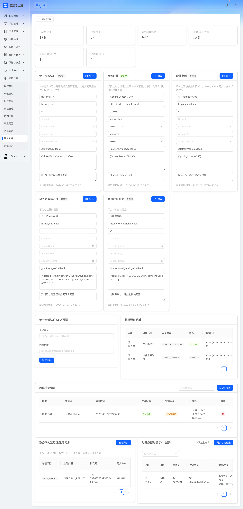

# 第5章 需求理解与业务分析

## 5.0 本章响应说明
本章围绕招标文件对“需求理解与业务分析”的评分要求进行编制，重点从行业宏观背景、监管逻辑、甲方平台建设目标、核心业务场景、全模块业务理解、建设边界与现阶段系统页面支撑等维度展开说明，确保既体现投标人对渣土消纳行业的理解深度，也体现对甲方平台建设目的、建设重点和业务落地路径的准确把握。

## 5.0.1 评分项响应矩阵
为便于评审专家快速对应本章内容与评分点关系，现将本章响应位置明确如下：

| 招标评分关注点 | 本章响应内容 | 对应章节 |
|---|---|---|
| 对渣土消纳行业业务背景的理解 | 行业发展背景、参与主体、监管逻辑、建设必要性、建设目标理解 | 5.1.1 至 5.1.5 |
| 对合同结算核心业务需求的分析 | 合同台账、审批、变更、延期、结算、经营统计分析 | 5.2.2 |
| 对项目管理核心业务需求的分析 | 项目主数据、业务配置、日报报表、项目级监管规则 | 5.2.3 |
| 对场地运营核心业务需求的分析 | 场地主档、容量、设备、运营、安全、结算分析 | 5.2.5 |
| 对车辆监管核心业务需求的分析 | 车辆、车队、调度、轨迹、证照、异常监管 | 5.2.6 |
| 对预警处置核心业务需求的分析 | 多维预警、规则配置、事件联动、消息闭环 | 5.2.7 |
| 对功能模块理解的完整性 | 25 个功能模块建设重点和协同关系总览 | 5.3.1 |
| 对现有建设基础和落地支撑的说明 | 已开发页面截图和页面支撑说明 | 5.4 |

## 5.1 投标人对渣土消纳行业业务背景的理解

### 5.1.1 对行业治理背景的理解
渣土消纳行业处于城市建设、生态治理、交通运输、自然资源管理和城市精细化治理的交叉领域。随着县域城镇化建设、园区建设、基础设施更新和拆改项目持续推进，渣土产生量、运输频次、消纳资源统筹难度和跨部门监管压力同步增加。传统管理模式普遍存在项目源头数据分散、处置证与准运证信息割裂、运输过程主要依赖人工抽查、进出场称重及核验标准不统一、违规取证链条不完整、统计分析滞后等问题，难以支撑高频监管、精准执法和资源统筹。

甲方建设本平台，本质上不是单纯建设一套业务填报系统，而是建设一套“以数据运营为核心、以全过程监管为主线、以多方协同为手段、以治理增效为目标”的渣土消纳一体化平台。平台既要面向监管部门提供审批联动、运行监管、异常预警、统计分析和执法留痕能力，也要面向企业提供合同结算、项目协同、场地运营、车辆组织、现场打卡、移动确认等能力，从而推动渣土管理从经验驱动走向数据驱动。

### 5.1.2 对行业参与主体的理解
渣土消纳业务涉及多角色协同，平台建设必须围绕角色职责设计业务链路与权限边界：

| 角色 | 核心职责 | 平台关注重点 |
|---|---|---|
| 主管部门/监管单位 | 审批、监管、执法、统计、预警处置 | 数据归集、过程监管、异常识别、证据留痕、综合研判 |
| 建设单位/出土单位 | 项目立项、出土组织、合同签订、费用结算 | 项目台账、出土计划、合同执行、打卡核验 |
| 运输单位/车队 | 车辆组织、驾驶员管理、运输执行 | 车辆档案、车队调度、定位轨迹、异常运输分析 |
| 消纳场运营方 | 场地接收、称重核验、容量管理、现场安全 | 进出场核验、消纳确认、场地运营、容量预警 |
| 场地值守/现场人员 | 进场核验、现场拍照、异常上报 | 小程序作业、移动打卡、事件上报、现场留痕 |
| 财务/经营人员 | 合同入账、结算核算、费用分析 | 合同履约、结算单据、应收应付、经营报表 |

### 5.1.3 对行业监管逻辑的理解
渣土消纳监管不是单点监管，而是典型的“事前准入、事中监控、事后追责、数据复盘”的闭环监管体系：

1. 事前监管强调“项目、证件、车辆、场地”四类主体合法合规，重点控制准入。
2. 事中监管强调“路线、位置、时间、重量、影像、现场确认”六类过程数据实时可感知，重点控制违规。
3. 事后监管强调“异常预警、事件处置、留痕审计、责任倒查、统计考核”闭环可追溯，重点控制责任。
4. 综合治理强调监管部门、运营企业、运输单位、场地方之间的数据互通和流程联动，重点控制协同。

### 5.1.4 对甲方建设本平台现实必要性的理解
结合招标文件项目简介，甲方建设本平台的核心目的可归纳为以下五点：

1. 解决渣土数据分散、标准不一、信息利用率低的问题，形成统一数据底座。
2. 解决传统人工监管效率低、执法取证难的问题，形成全过程数字化监管链路。
3. 解决审批、出土、运输、消纳、称重、结算环节割裂的问题，形成业务联动。
4. 解决异常发现滞后、处置闭环不足的问题，形成实时预警和事件闭环。
5. 解决数据沉淀但价值挖掘不足的问题，形成统计建模、经营分析和治理支撑能力。

### 5.1.5 对平台建设目标的理解
平台建设目标应体现“三个转变、四类支撑、五项价值”：

| 目标层面 | 建设目标 |
|---|---|
| 管理模式转变 | 从人工台账走向数字台账，从经验管理走向数据治理，从事后追责走向风险前置 |
| 业务支撑 | 支撑合同结算、项目管理、场地运营、车辆监管、事件预警等核心业务数字化 |
| 监管支撑 | 支撑在线审批联动、运输过程监管、无纸化核验、无感称重、影像追溯、异常研判 |
| 数据支撑 | 支撑数据归集治理、统计分析、模型研判、精准查询、可视化看板、数据服务输出 |
| 综合价值 | 实现企业降本增效、监管精准化、廉政风险防控强化、生态治理协同、产业优化支撑 |

## 5.2 对核心业务需求的深入分析

### 5.2.1 业务全链条理解
结合甲方建设目标，本平台业务链条可概括为“项目立项与准入 -> 合同签订与费用约定 -> 处置证及相关证照联动 -> 车辆与人员组织 -> 出土打卡与现场拍照 -> 运输过程监控 -> 场地核验与称重 -> 消纳确认与台账形成 -> 对账结算与统计分析 -> 预警处置与执法追溯”。

该链条的难点不在某一个环节，而在于跨环节数据的统一主线建设。平台应围绕“项目编号、合同编号、证件编号、车辆编号、场地编号、运单/消纳记录编号”构建统一业务关联，确保任何一条预警、一次称重、一次进场、一次打卡，都可以回溯到对应项目、合同、车辆和场地。

### 5.2.2 合同结算业务需求分析
合同结算是平台经营管理和财务闭环的核心，既要满足合同台账管理，也要满足进度跟踪、变更延期、内拨申请、项目结算和场地结算等复杂业务场景。

#### （1）需求理解
1. 需要统一管理线上合同、线下补录合同和历史导入合同，避免合同台账分散。
2. 需要建立合同与项目、场地、建设单位、运输单位、处置证之间的关联关系。
3. 需要支撑合同入账、审批、导入导出、变更、延期、结算、月报、单位统计等经营管理场景。
4. 需要对合同约定方量、执行方量、应收金额、已收金额、欠款金额、结算状态进行全过程跟踪。

#### （2）业务分析
合同结算模块既是经营模块，也是监管支撑模块。经营上，它要解决应收应付不清、合同执行不透明、结算对账困难的问题；监管上，它要支撑项目是否按约定场地消纳、合同是否超量执行、结算是否与称重和消纳数据匹配等问题。因此合同模块不能仅做静态档案管理，必须与项目、场地、消纳清单、称重记录和统计分析模块联动。

#### （3）功能边界
本期重点覆盖合同生命周期管理、合同过程审批、合同执行跟踪、项目/场地结算及经营统计；不将复杂财务总账、税票管理、企业 ERP 全量替代纳入本期边界。

#### （4）关键按钮与操作理解
| 页面 | 关键按钮 | 业务意图 |
|---|---|---|
| 合同清单 | 新增、导入、导出、查看详情、发起审批 | 建立合同台账并触发流程 |
| 合同详情 | 查看执行进度、关联项目、关联场地、发起变更/延期 | 跟踪履约情况 |
| 合同入账 | 入账确认、提交审核 | 形成财务确认链路 |
| 结算页面 | 生成结算单、确认结算、导出结算 | 形成经营闭环 |

### 5.2.3 项目管理业务需求分析
项目管理模块是平台的源头主数据模块，决定平台后续审批、出土、打卡、场地投放、预警判断和统计分析的准确性。

#### （1）需求理解
1. 需要建立项目主档、项目状态、组织归属、交款数据、关联合同、关联场地、关联处置证等统一档案。
2. 需要围绕项目配置打卡规则、位置判断、线路配置、违规规则、日报统计等内容。
3. 需要实现项目级业务口径统一，作为全平台业务核算主线。

#### （2）业务分析
项目管理模块承担“源头治理”作用。若项目主档缺失或配置不准，将直接导致后续现场打卡口径不统一、车辆线路判断失真、处置证匹配错误、预警阈值不准确。因此项目管理既是业务运营入口，也是监管规则配置入口。

#### （3）功能边界
本期重点覆盖项目台账、项目配置、项目日报、项目报表和项目级违规研判；不将工程施工进度管理、BIM 施工协同、造价全过程管理纳入本期范围。

#### （4）关键按钮与操作理解
| 页面 | 关键按钮 | 业务意图 |
|---|---|---|
| 项目清单 | 新增项目、编辑、查看详情 | 建立源头项目档案 |
| 项目配置 | 打卡配置、位置判断、线路配置、违规配置 | 建立项目级监管规则 |
| 项目日报 | 生成日报、查看明细、导出 | 跟踪项目日度运行 |
| 项目报表 | 筛选、导出、对比分析 | 做项目经营与监管分析 |

### 5.2.4 处置证管理业务需求分析
处置证是项目合法运输和消纳的重要合规凭证。平台需要实现与政务审批侧的数据联动，并通过证件与项目、合同、车辆、场地的关联，形成证照监管基础。

#### （1）需求理解
1. 支撑处置证同步、手工新增、业务关联等场景。
2. 支撑处置证与项目、合同、场地、准运车辆的关系校验。
3. 支撑证件有效期、使用状态、异常状态等监管需求。

#### （2）业务分析
处置证如果只停留在查询层面，不能满足监管要求。平台应将处置证作为业务准入校验的一部分，在项目配置、车辆监管、消纳确认、异常预警等环节发挥作用。例如无有效证件不得进入正常业务链路，证件超期或关联关系不一致应触发预警。

#### （3）功能边界
本期重点实现证件数据同步与业务联动，不替代政务审批系统原有审批流程本身。

### 5.2.5 场地运营业务需求分析
消纳场地是渣土消纳业务的落点，也是数据采集最密集、风险控制最关键的节点之一。平台需围绕场地容量、资质资料、运营配置、进出场核验、结算报表、安全管理等构建一体化运营能力。

#### （1）需求理解
1. 需要管理场地列表、场地资料、基础信息、设备配置、人员配置、运营配置和安全管理。
2. 需要支撑消纳清单、场地结算、消纳报表、坝体/传感器数据对接等能力。
3. 需要实现“现场作业 + 远程监管 + 经营核算”三位一体。

#### （2）业务分析
场地是最容易产生容量超限、核验不一致、违规入场、称重异常、现场安全隐患等问题的业务节点。因此场地模块必须同时服务三类目标：一是提升场地运营效率，二是提升监管在线化能力，三是提升经营结算准确性。场地模块与地磅、视频、传感器、小程序、预警中心是强耦合关系。

#### （3）功能边界
本期重点覆盖场地台账、运营配置、接收核验、容量监测、结算统计、安全台账；不替代专业 SCADA、完整视频平台和大型设备运维系统。

#### （4）关键按钮与操作理解
| 页面 | 关键按钮 | 业务意图 |
|---|---|---|
| 场地列表 | 新增场地、查看详情、配置设备 | 建立场地主档并进入运营配置 |
| 消纳清单 | 查询、确认、导出 | 管理进出场消纳记录 |
| 场地资料 | 上传资料、更新资质、查看附件 | 保证场地资料完备 |
| 场地结算 | 生成结算、确认结算、导出 | 形成经营闭环 |

### 5.2.6 车辆监管业务需求分析
车辆监管是全过程监管中最容易产生违规风险的环节，平台需要覆盖车辆、车队、驾驶员、人证、保险、维修维保、油电卡、运输计划、定位跟踪和违规清单等能力。

#### （1）需求理解
1. 支撑车辆台账、车型管理、车队信息、车辆状态、保险到期、维保计划、人证管理等静态与半动态数据管理。
2. 支撑运输计划、调度申请、调度审批、实时轨迹、送货跟踪、违规车辆清单等动态监管。
3. 支撑车辆与项目、处置证、线路、驾驶员和场地之间的关联校验。

#### （2）业务分析
车辆监管不仅是设备定位问题，更是“人、车、证、线、时、位”六要素统一监管问题。平台需要对车辆准入、线路偏离、停留超时、离线、未按规定场地消纳、证照过期等进行综合判断，并与预警、事件、消息和小程序联动。

#### （3）功能边界
本期重点覆盖车队经营监管和运输过程监管，不替代专业车联网平台底层通信能力。

### 5.2.7 预警处置业务需求分析
预警管理是监管价值的集中体现。平台需要把海量业务数据转化为可感知、可分派、可处置、可考核的风险事件。

#### （1）需求理解
1. 支撑场地预警、项目预警、人员预警、车辆预警、合同预警等多类风险识别。
2. 支撑预警规则配置、阈值设定、通知推送、处置反馈、结果留痕。
3. 支撑预警向事件、消息、统计、考核的闭环联动。

#### （2）业务分析
预警的价值不在于“弹出提醒”，而在于把风险从隐性变成显性，并推动处置闭环。对于甲方而言，真正需要的是“谁在什么时间、什么地点、因为什么原因发生了什么风险、是否已处置、是否可追责”的业务闭环。因此预警系统应具备规则化、自动化、留痕化、可追溯四项能力。

#### （3）功能边界
本期重点覆盖规则配置、预警识别、处置闭环和统计分析，不将复杂 AI 视频算法平台作为本期独立建设范围。

### 5.2.8 统计分析与数据看板业务需求分析
统计分析和数据看板承接平台的数据价值输出，是对管理层、监管层和运营层提供决策支撑的重要能力。

#### （1）需求理解
1. 支撑按项目、场地、车辆、单位、合同、时间等维度进行统计。
2. 支撑看板总览、项目分析、场地分析、地图展示、运力分析等可视化能力。
3. 支撑异常趋势、经营指标、监管指标、容量指标的多维展示。

#### （2）业务分析
统计分析不能停留在静态报表，而应兼顾监管考核和经营决策两个方向。一方面帮助监管方快速识别异常趋势、重点区域和重点对象；另一方面帮助企业分析合同执行、场地投放、车辆效率和成本收益情况。数据看板是对业务数据、预警数据、地理数据、设备数据的综合展示层。

### 5.2.9 平台管理与协同支撑需求分析
除核心生产业务外，平台还需具备单位管理、组织管理、人员管理、角色权限、审批配置、字典参数、系统日志、消息管理、信息查询、安全管理、平台对接等支撑模块，以保证平台可配置、可审计、可运营、可扩展。

| 支撑模块 | 业务意义 |
|---|---|
| 单位/组织/人员/角色 | 建立多角色、多组织、多层级管理体系 |
| 审批配置 | 支撑合同、调度、维修、延期等流程可配置 |
| 数据字典/系统参数 | 统一口径，避免人工维护混乱 |
| 系统日志/安全管理 | 满足审计追踪、权限控制和安全留痕 |
| 消息管理 | 满足预警通知、待办提醒、业务告警推送 |
| 信息查询 | 满足打卡、消纳、轨迹等监管数据快速检索 |
| 平台对接 | 满足政务审批、定位、地磅、视频等外部协同 |

### 5.2.10 移动端业务需求分析
甲方明确要求移动端和小程序能力，说明平台建设不仅服务后台监管，也要服务现场作业。移动端至少应覆盖出土打卡、消纳确认、事件上报、车辆跟踪、异常申报、问题反馈、安全教育等典型场景。

移动端建设的关键不只是把 PC 端页面缩小，而是围绕现场人员的作业特点进行简化设计，重点解决“操作步骤少、采集信息准、网络条件差、现场可追责”的问题。因此移动端能力必须具备定位、拍照、时间戳、附件上传、离线重试、消息提醒和角色化入口等特性。

## 5.3 全模块业务理解与建设重点归纳

### 5.3.1 模块覆盖总览
| 模块 | 建设重点 | 关键协同对象 |
|---|---|---|
| 合同结算 | 合同台账、审批、入账、变更、延期、结算、月报 | 项目、场地、统计分析 |
| 单位管理 | 单位档案、资质信息、类型分类 | 组织、项目、合同 |
| 项目管理 | 项目主档、交款、日报、配置、线路、违规口径 | 合同、处置证、车辆、预警 |
| 处置证管理 | 证件同步、证件新增、业务关联 | 政务网、项目、车辆 |
| 消纳场地管理 | 场地主档、容量、设备、资料、清单、结算 | 地磅、视频、预警、小程序 |
| 违规车辆清单 | 违规明细、整改跟踪 | 车辆管理、预警、事件 |
| 事件管理 | 事件上报、派发、反馈、闭环 | 小程序、消息、预警 |
| 系统预警 | 多维预警识别、处置、统计 | 规则配置、消息、看板 |
| 预警配置 | 规则参数、阈值、通知策略 | 预警中心 |
| 违规车辆研判模型 | 数据聚合、规则研判、风险画像 | 车辆、轨迹、处置证 |
| 信息查询 | 打卡查询、消纳查询、轨迹查询、综合查询 | 项目、车辆、场地 |
| 组织管理 | 组织树、上下级关系 | 用户、角色、数据权限 |
| 组织人员管理 | 人员账号、岗位、归属关系 | 组织、权限 |
| 角色管理 | 角色权限、菜单权限、按钮权限 | 全平台 |
| 系统日志 | 登录日志、操作日志、接口日志 | 安全、审计 |
| 审核审批配置 | 流程模板、节点配置、审批人规则 | 合同、车辆、场地 |
| 数据字典 | 枚举口径、字段选项、业务分类 | 全平台 |
| 系统参数配置 | 通用参数、开关配置、阈值配置 | 全平台 |
| 统计分析 | 专题分析、经营分析、监管统计 | 合同、项目、场地、车辆 |
| 数据看板 | 总览看板、地图看板、项目场地专题 | 统计、GIS、预警 |
| 平台对接 | 政务网、GPS、地磅、视频、单点登录 | 外部系统 |
| 消息管理 | 预警推送、待办消息、系统通知 | 预警、审批、移动端 |
| 小程序 | 出土打卡、消纳确认、事件上报、现场查询 | 项目、场地、车辆、消息 |
| 安全管理 | 账号安全、权限控制、合规审计 | 系统日志、角色权限 |
| 车辆管理 | 车辆、车队、保险、维修、调度、财务、报表 | 项目、定位、预警 |

### 5.3.2 功能边界归纳
平台建设重点是“渣土运输与消纳监管业务平台”，不是无边界的大而全系统。本期边界重点放在渣土监管和运营核心主线能力，不以替代甲方所有政务审批系统、企业 ERP、财务总账系统、专业视频平台、专业车联网底层平台和大型 IoT 平台为目标，而是通过标准接口实现业务联动和数据协同。

### 5.3.3 内容限制与输出目标理解
1. 所有核心业务数据应具备统一编号、统一时间口径、统一状态口径。
2. 所有业务台账应支持筛选、查看、导出和追溯。
3. 所有现场采集类数据应至少具备时间、地点、采集人、关联对象和附件留痕。
4. 所有异常类业务应至少具备识别、通知、处置、反馈和统计能力。
5. 所有移动端作业应围绕少步骤、强校验、易追责来设计。

### 5.3.4 全模块理解与评分点映射
从评标视角看，甲方虽然重点关注合同结算、项目管理、场地运营、车辆监管和预警处置，但真正能够支撑这些核心业务稳定运行的，是全模块协同能力。为此，本方案已将单位管理、组织权限、审批配置、数据字典、系统日志、信息查询、平台对接、消息管理、小程序、安全管理等支撑模块纳入整体业务理解范围，避免方案仅停留在几个主模块层面，确保平台具备“核心业务可运行、支撑模块可协同、治理能力可持续”的完整建设逻辑。

## 5.4 现阶段系统页面支撑说明
现阶段系统已具备较为完整的后台页面基础，能够对合同、项目、场地、车辆、预警、看板、对接配置、组织权限等模块形成演示和实施支撑。建议在正式投标 Word 稿中插入以下页面截图，以增强方案的可视化和可信度。

| 建议插图位置 | 建议页面 | 建议说明文字 |
|---|---|---|
| 图5-1 | 系统首页/数据看板 | 展示平台总览、关键指标、监管视图与地图联动能力 |
| 图5-2 | 合同结算页面 | 展示合同清单、执行状态、审批流转和经营指标 |
| 图5-3 | 项目管理页面 | 展示项目台账、交款进度、关联合同和配置能力 |
| 图5-4 | 消纳场地页面 | 展示场地列表、容量状态、资料管理和运营配置能力 |
| 图5-5 | 车辆管理页面 | 展示车辆档案、运力统计、状态监控和调度基础 |
| 图5-6 | 预警监控页面 | 展示风险识别、分类预警、处置闭环和消息联动能力 |
| 图5-7 | 平台对接配置页面 | 展示外部系统接入、参数维护和接口治理能力 |

### 图5-1 平台数据看板示意

### 图5-2 合同结算模块页面示意

### 图5-3 项目管理模块页面示意

### 图5-4 消纳场地模块页面示意

### 图5-5 车辆管理模块页面示意

### 图5-6 预警监控模块页面示意

### 图5-7 平台对接配置页面示意

## 5.5 本章结论
综合以上分析，投标人认为甲方本次平台建设的重点不只是完成若干功能点开发，而是围绕渣土消纳行业“数据归集、业务联动、过程监管、异常预警、结算分析、移动协同、对外对接、安全运营”的完整链条，建设一套面向监管部门、运营单位、运输单位和场地方协同使用的一体化平台。平台建设应坚持业务主线清晰、角色边界明确、数据标准统一、过程留痕可追、移动作业可落地、外部对接可扩展、安全运维可持续，方可真正支撑甲方实现行业治理数字化转型目标。
