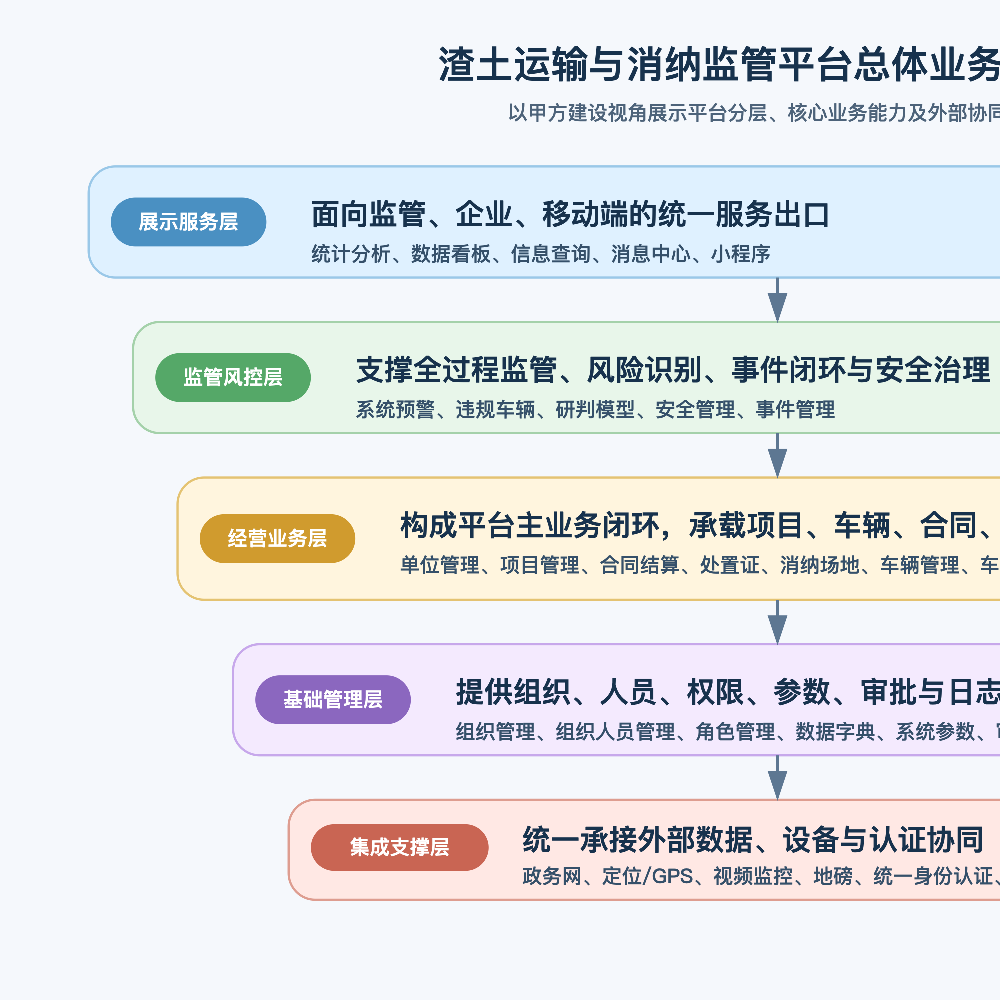
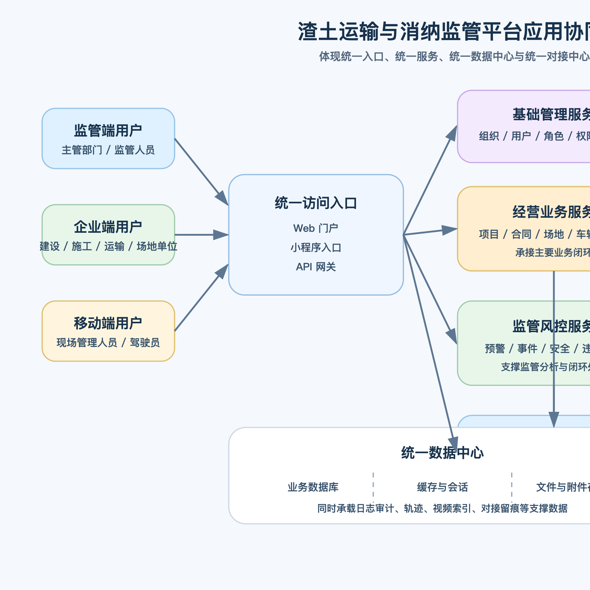
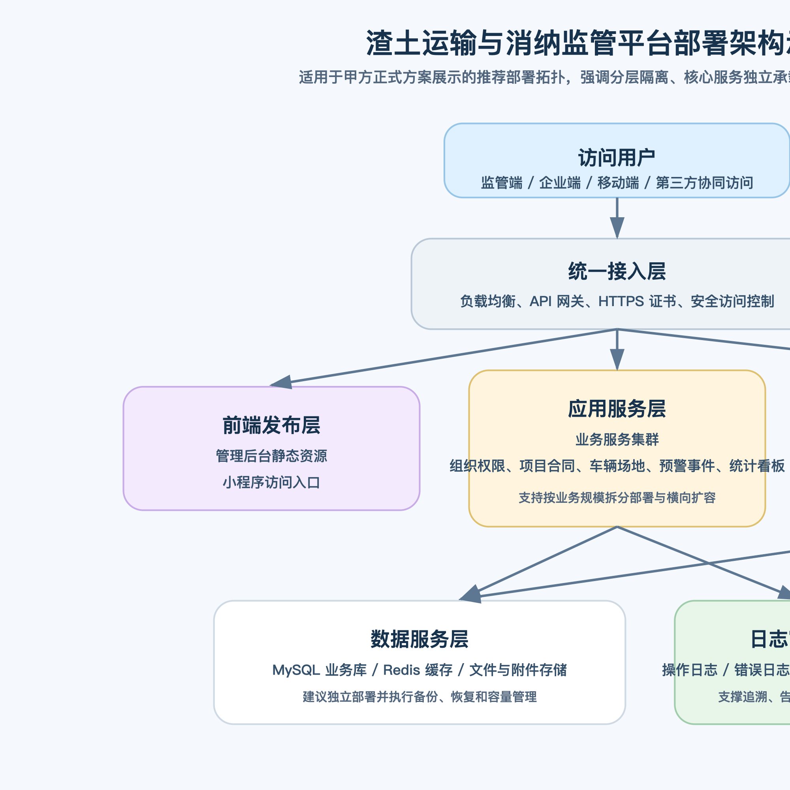

# 第6章 技术方案

## 6.0 本章响应说明
本章围绕招标文件对“多租户 SaaS 平台技术架构方案”的评分要求进行编制，先说明平台总体技术架构、多租户隔离、权限管理、数据安全和弹性扩展设计，再按功能模块逐项说明拟提供的技术能力、关键业务接口、业务流程和异常处理机制，确保技术方案完整、清晰、合理、可落地。

## 6.0.1 本章高分响应摘要
1. 先从多租户 SaaS 总体架构出发，回答租户隔离、权限管理、数据安全和弹性扩展四个评分核心点。
2. 将多租户能力进一步细化到租户识别链路、缓存/消息/附件/任务隔离、租户级审计和运维扩展，体现技术方案深度。
3. 再按招标文件全部功能模块逐项拆解技术能力、接口内容、业务流程和异常处理，避免仅有总架构、缺少模块落地。
4. 结合总体架构图、应用协同图和部署图，形成“总体架构 + 模块技术 + 实施可行性”的完整技术答卷。

评分关键词：多租户 SaaS、租户隔离、权限安全、架构可扩展、模块技术方案完整。

## 6.1 多租户 SaaS 平台总体技术架构方案

### 6.1.1 总体架构设计原则
平台总体技术架构遵循“统一底座、租户隔离、模块解耦、接口标准、数据安全、弹性扩展、信创适配”的原则，采用前后端分离和分层服务设计，形成“接入层 + 应用层 + 业务服务层 + 数据层 + 集成层 + 运维安全层”的总体架构。

### 6.1.2 多租户架构设计
平台采用多租户 SaaS 设计，支持在同一套应用底座上服务多个租户、多个组织和多类角色，并兼顾平台级管理与租户级独立运营。

| 能力项 | 技术方案 |
|---|---|
| 租户隔离 | 在账号、组织、业务数据、配置参数、统计口径、消息范围等层面引入租户标识，确保不同租户数据逻辑隔离 |
| 数据隔离 | 通过数据库租户字段、查询拦截、权限过滤、组织范围控制实现数据隔离；关键场景支持按租户分库/分实例扩展 |
| 菜单隔离 | 不同租户可按开通模块、角色权限和组织职责显示不同菜单、按钮和操作入口 |
| 配置隔离 | 字典、流程、预警阈值、消息模板、接口参数等支持租户级配置 |
| 运维隔离 | 接口限流、日志检索、告警分组、备份策略可按租户或项目集群维度管理 |

### 6.1.3 权限管理设计
平台采用“租户 + 组织 + 用户 + 角色 + 菜单 + 按钮 + 数据范围”的七层权限模型，既满足监管部门分级授权，也满足企业多部门协同的复杂场景。

1. 租户级控制平台使用范围和模块开通范围。
2. 组织级控制上下级机构、区域和业务归属。
3. 用户级控制登录身份和个人权限。
4. 角色级控制菜单、按钮和审批职责。
5. 数据范围控制本人、本组织、本区域、跨部门授权等访问边界。
6. 审批权限控制流程节点可见性和操作权限。
7. 日志审计记录关键操作、审批和接口行为，满足追责需求。

### 6.1.4 租户识别链路与隔离落地机制
为避免多租户能力停留在概念层面，平台在技术实现上建立完整的租户识别与隔离链路：

1. 登录阶段：用户登录时绑定租户身份，令牌中携带租户标识、用户标识和组织标识。
2. 接口阶段：所有业务请求进入系统后先完成令牌解析和租户识别，再进入权限校验和业务处理。
3. 数据访问阶段：查询条件自动追加租户范围，更新写入自动回填租户字段，防止跨租户串写。
4. 数据权限阶段：在租户隔离基础上叠加组织范围、区域范围、项目范围和角色权限，实现“先租户、后组织、再数据”的分层控制。
5. 审计阶段：所有关键业务日志、审批日志和接口日志均保留租户维度，便于租户级审计和问题追溯。

### 6.1.5 租户级配置、缓存与消息隔离设计
平台除业务表数据外，还对以下关键能力进行租户级隔离设计：

| 隔离对象 | 落地方式 |
|---|---|
| 配置参数 | 字典、参数、流程模板、预警阈值、消息模板按租户独立维护 |
| 缓存数据 | 缓存键统一带租户前缀，防止不同租户统计结果和会话数据串扰 |
| 附件文件 | 附件目录或对象存储路径按租户或业务归属分类管理 |
| 异步任务 | 定时任务、对接任务、统计任务记录租户上下文，确保任务结果写回正确租户 |
| 消息通知 | 待办、预警、站内信按租户和组织双重范围投递 |
| 导出报表 | 导出任务按租户隔离生成，文件访问受权限和有效期控制 |

### 6.1.6 租户级运维审计、备份与弹性扩展
1. 对租户访问量、接口耗时、异常率、消息投递失败率支持按租户统计和监控。
2. 对关键租户可实施分级保障策略，包括独立资源池、独立备份周期和重点运维关注。
3. 当租户规模扩大或业务量提升时，可平滑演进到按租户分库、按租户独立文件存储、按业务域拆分服务的部署模式。
4. 对租户级配置变更、权限变更和接口参数变更保留审计记录，支持回溯和回滚。

### 6.1.7 数据安全设计
平台数据安全围绕“采集安全、传输安全、存储安全、访问安全、审计安全、备份安全”展开：

| 安全域 | 技术方案 |
|---|---|
| 身份认证 | 账号密码登录、验证码登录、统一认证对接、Token 鉴权、过期失效控制 |
| 传输安全 | HTTPS、内外网隔离、接口签名、时间戳、防重放 |
| 存储安全 | 业务敏感字段脱敏展示、附件分类存储、数据库权限最小化、备份加密 |
| 访问安全 | 角色权限、按钮权限、数据权限、接口鉴权、租户隔离 |
| 操作审计 | 登录日志、操作日志、接口日志、审批留痕、异常留痕 |
| 恢复保障 | 全量备份、增量备份、关键数据恢复演练和容灾切换预案 |

### 6.1.8 弹性扩展能力设计
平台采用模块化架构和标准化接口设计，支持后续按业务量增长进行横向扩展。

1. 前端采用模块化页面结构，支持新菜单、新页面和移动端入口快速扩展。
2. 后端采用分层服务和领域模块拆分，便于按业务域扩展接口与服务能力。
3. 集成层采用统一接口规范，便于新增政务接口、IoT 设备接口和消息网关。
4. 数据层支持热点表索引优化、分区、归档和读写分离扩展。
5. 部署层支持单体起步、服务拆分、容器化部署和集群扩容演进。

### 6.1.9 总体架构图说明
本章配套总体业务架构图、应用协同架构图和部署架构图，用于增强技术方案可视化表达。

图示说明：以上架构图用于辅助说明平台业务架构、应用协同关系和部署路径，与本章多租户 SaaS 技术方案形成一体化支撑。

## 6.2 技术分层与公共能力设计

### 6.2.1 前端展现层
前端采用 React + Vite 技术栈构建 PC 管理端，采用组件化页面结构承载合同、项目、场地、车辆、预警、统计、系统设置等模块；移动端采用小程序方案承载现场打卡、消纳确认、事件上报、车辆查询等轻量高频能力。

### 6.2.2 业务服务层
后端采用 Spring Boot 分层架构，按控制层、业务服务层、基础设施层组织，实现业务接口统一暴露、业务规则集中管理、数据访问统一封装和对接能力统一治理。

### 6.2.3 集成交换层
集成层统一承接政务审批、GPS 定位、地磅称重、视频监控、统一认证等第三方系统的接口适配，支持同步、回调、轮询、补偿、重试、对账和监控。

### 6.2.4 数据治理层
平台围绕项目、合同、场地、车辆、证件、预警、事件、称重、打卡、消息、组织等建立统一数据模型，并通过字典、参数、编码规则和主数据校验机制保证数据口径一致。

## 6.3 全功能模块技术方案总览
为保证方案完整性，平台按招标文件全部功能模块逐项设计技术能力。各模块均围绕“能力提供、关键接口、业务流程、异常处理、扩展方向”五个方面进行规划。

| 模块 | 拟提供能力 | 关键业务接口内容 | 业务流程要点 | 异常处理机制 |
|---|---|---|---|---|
| 合同结算 | 合同台账、审批、入账、导入导出、变更延期、项目/场地结算 | 合同列表查询、合同新增、导入预校验、提交审批、生成结算单 | 合同创建 -> 审批 -> 执行跟踪 -> 结算确认 -> 报表统计 | 导入校验失败回执、审批驳回回写、结算数据不一致预警 |
| 单位管理 | 单位档案、资质信息、单位类型维护 | 单位新增、单位查询、资质更新 | 单位建档 -> 资质维护 -> 业务引用 | 重复单位识别、禁用单位引用拦截 |
| 项目管理 | 项目主档、交款、日报、规则配置、线路配置、项目报表 | 项目新增、项目详情、日报生成、线路保存、配置发布 | 项目建档 -> 规则配置 -> 过程采集 -> 日报/报表生成 | 缺失基础配置阻断启用、配置冲突提示 |
| 处置证管理 | 证件同步、证件新增、证件关联 | 证件同步接口、证件详情查询、证件关联保存 | 证件同步/录入 -> 关联项目/车辆 -> 有效性校验 | 同步失败重试、证件状态异常预警 |
| 消纳场地管理 | 场地主档、消纳清单、资料、设备、容量、结算、安全 | 场地新增、场地详情、设备绑定、消纳确认、场地结算 | 场地建档 -> 设备接入 -> 进场核验 -> 容量统计 -> 结算分析 | 设备离线告警、容量超阈预警、称重异常回补 |
| 违规车辆清单 | 违规车辆聚合、整改跟踪 | 违规列表查询、整改反馈 | 规则识别 -> 违规入库 -> 跟踪处置 | 重复违规合并、误判复核 |
| 事件管理 | 事件上报、派发、处置、反馈、归档 | 事件上报、事件派单、事件反馈 | 事件发现 -> 上报 -> 派发 -> 处理 -> 归档 | 超时提醒、附件缺失提示 |
| 系统预警 | 多维预警识别、处置闭环、统计分析 | 预警查询、预警认领、处置反馈 | 规则命中 -> 预警生成 -> 通知 -> 处置 -> 统计 | 去重、升级、超时催办 |
| 预警配置 | 阈值规则、通知策略、启停控制 | 规则保存、规则启停、策略发布 | 规则配置 -> 生效 -> 命中计算 | 配置冲突校验、版本回滚 |
| 违规车辆研判模型 | 轨迹研判、证照研判、风险画像 | 模型运行、研判结果查询 | 数据汇聚 -> 模型研判 -> 输出清单 | 低质量数据剔除、人工复核 |
| 信息查询 | 打卡、消纳、轨迹、综合查询 | 查询接口、导出接口 | 条件检索 -> 结果展示 -> 导出 | 大数据量分页、导出异步化 |
| 组织管理 | 组织树、组织层级维护 | 组织新增、组织树查询 | 组织建模 -> 权限映射 -> 数据归属 | 循环层级拦截、禁用保护 |
| 组织人员管理 | 人员账号、岗位、归属关系 | 用户新增、用户查询、状态变更 | 人员入库 -> 角色授权 -> 业务使用 | 重复账号校验、离职回收 |
| 角色管理 | 菜单权限、按钮权限、数据权限 | 角色新增、授权保存、范围配置 | 角色建立 -> 授权 -> 生效 | 越权校验、最小权限控制 |
| 系统日志 | 登录、操作、接口日志 | 日志查询、日志导出 | 行为发生 -> 日志落库 -> 审计查询 | 大日志量归档、敏感信息脱敏 |
| 审核审批配置 | 流程模板、节点审批规则 | 模板保存、流程发布 | 模板配置 -> 业务绑定 -> 发起审批 | 节点缺失校验、流程回退 |
| 数据字典 | 字典项维护、枚举统一 | 字典查询、字典新增 | 口径配置 -> 模块引用 | 重复编码拦截、引用保护 |
| 系统参数配置 | 参数管理、全局开关 | 参数查询、参数更新 | 参数维护 -> 生效 | 关键参数修改审计 |
| 统计分析 | 专题分析、经营统计、监管统计 | 统计查询、专题导出 | 数据汇总 -> 聚合计算 -> 图表展示 | 计算超时降级、缓存重建 |
| 数据看板 | 总览、项目、场地、地图、运力分析 | 看板查询、地图数据查询 | 数据装配 -> 指标展示 -> 钻取联动 | GIS 数据异常降级、缓存兜底 |
| 平台对接 | 政务网、GPS、地磅、视频、单点登录 | 接口配置、同步任务、回调接收 | 对接配置 -> 数据交换 -> 对账补偿 | 重试、补偿、监控告警 |
| 消息管理 | 站内信、待办、预警通知 | 消息查询、已读回执、发送接口 | 业务触发 -> 消息投递 -> 回执统计 | 发送失败重投、去重防刷 |
| 小程序 | 出土打卡、消纳确认、事件上报、现场查询 | 登录、打卡提交、确认提交、事件上报 | 用户登录 -> 现场操作 -> 后台校验 -> 留痕闭环 | 弱网重试、离线缓存、定位失败兜底 |
| 安全管理 | 账号安全、密码策略、权限审计 | 密码修改、登录审计、权限校验 | 登录 -> 认证 -> 鉴权 -> 审计 | 暴力破解限制、异常登录告警 |
| 车辆管理 | 车辆、车队、保险、维修、维保、调度、财务、报表 | 车辆新增、调度审批、轨迹查询、维保记录 | 车辆建档 -> 调度执行 -> 过程监管 -> 经营统计 | 轨迹离线补传、证照到期预警 |

## 6.4 核心功能模块技术方案详述

### 6.4.1 合同结算管理技术方案
#### （1）拟提供能力
提供合同清单、合同详情、合同入账、合同导入导出、线下合同录入、合同审批、消纳合同发起、变更合同发起、消纳延期、内拨申请、项目结算、场地结算、月报统计、单位统计等能力。

#### （2）关键业务接口内容描述
1. 合同列表查询接口：支持按合同编号、合同类型、项目、场地、状态、审批状态筛选。
2. 合同新增/修改接口：写入合同主档、金额、方量、关联主体及附件信息。
3. 合同审批接口：提交审批、审批通过、审批驳回、状态回写。
4. 结算生成接口：根据合同执行数据、称重数据和消纳数据生成结算结果。
5. 导入预检接口：用于校验导入字段、字典值、重复数据和金额格式。

#### （3）业务流程
合同录入/导入 -> 数据校验 -> 提交审批 -> 合同生效 -> 执行跟踪 -> 变更/延期 -> 项目或场地结算 -> 月报统计。

#### （4）异常处理
导入失败时返回逐行错误信息；审批驳回时回写驳回原因；合同结算与称重/消纳数据不一致时生成预警并允许人工复核。

### 6.4.2 项目管理技术方案
#### （1）拟提供能力
提供项目清单、交款数据、合同清单、场地清单、处置证清单、项目日报、打卡配置、位置判断配置、出土预扣值、线路配置、违法清单、报表统计、违规配置等能力。

#### （2）关键业务接口内容描述
1. 项目主档接口：管理项目基础信息、组织归属、状态和关联关系。
2. 交款数据接口：记录项目交款金额、时间、欠款情况。
3. 配置接口：管理线路、定位规则、打卡范围、违规阈值。
4. 日报接口：汇总项目日度出土量、消纳量、异常数、执行进度。

#### （3）业务流程
项目建档 -> 关联合同/证件/场地 -> 配置打卡与线路规则 -> 现场作业采集 -> 日报/报表生成 -> 异常研判。

#### （4）异常处理
缺少关键配置时禁止项目启用；线路配置冲突时强提醒；项目状态与证件状态不一致时触发预警。

### 6.4.3 处置证管理技术方案
#### （1）拟提供能力
提供处置证同步、处置证新增、处置证关联以及有效性校验能力。

#### （2）关键业务接口内容描述
1. 政务证件同步接口：定时或按需同步处置证/准运证信息。
2. 证件台账接口：展示证件编号、状态、有效期、关联项目和单位。
3. 证件关联接口：绑定项目、车辆、合同或场地。

#### （3）业务流程
外部同步/人工录入 -> 数据入库 -> 业务关联 -> 有效期校验 -> 监管引用。

#### （4）异常处理
同步失败记录接口日志并自动重试；证件过期、作废或关联缺失时禁止通过关键业务校验。

### 6.4.4 消纳场地管理技术方案
#### （1）拟提供能力
提供场地列表、消纳清单、场地资料、基础信息、场地结算、消纳报表、场地创建、场地测绘、设备配置、坝体数据对接、运营配置、人员配置和场地安全管理能力。

#### （2）关键业务接口内容描述
1. 场地台账接口：维护场地基础信息、等级、容量、地址、状态。
2. 设备接入接口：绑定地磅、摄像头、传感器等设备。
3. 消纳确认接口：记录车辆进出场、称重、确认结果和附件。
4. 容量统计接口：实时计算已用容量、剩余容量、趋势变化。
5. 场地结算接口：按场地和时间区间汇总结算数据。

#### （3）业务流程
场地建档 -> 设备绑定 -> 现场核验 -> 称重回传 -> 消纳确认 -> 容量更新 -> 报表和结算。

#### （4）异常处理
设备离线时转人工兜底；称重失败时记录待补传队列；容量超限、异常进场、资料过期自动触发预警。

### 6.4.5 车辆管理技术方案
#### （1）拟提供能力
提供车辆信息、保险管理、维修管理、维保计划、维保信息录入、维修申请、维修审批、车型管理、车辆信息维护、车队信息查询、车队信息维护、运输计划、车队调度申请、车队调度审批、油电卡管理、人证管理、财务管理和报表管理能力。

#### （2）关键业务接口内容描述
1. 车辆台账接口：管理车牌、车型、状态、所属单位、证照信息。
2. 车队调度接口：提交运输计划、调度申请和审批结果。
3. 轨迹查询接口：获取 GPS 实时位置和历史轨迹。
4. 维保接口：记录保险、年检、维保、维修、油电卡、人证状态。

#### （3）业务流程
车辆建档 -> 证照维护 -> 运输计划 -> 调度审批 -> 运输执行 -> 轨迹监管 -> 维保财务统计。

#### （4）异常处理
定位离线、轨迹中断、证照到期、调度与项目不匹配时自动告警；设备补传后自动修正轨迹链路。

### 6.4.6 系统预警与事件管理技术方案
#### （1）拟提供能力
提供场地预警、项目预警、人员预警、车辆预警、合同预警、规则配置、事件流转、消息推送和处置闭环。

#### （2）关键业务接口内容描述
1. 预警规则接口：维护阈值、命中条件、通知对象和处理时限。
2. 预警生成接口：接收业务事件并触发规则计算。
3. 事件派发接口：预警升级为事件后分派处理责任人。
4. 处置回执接口：记录处置过程、处置结论和附件。

#### （3）业务流程
业务事件采集 -> 规则引擎识别 -> 预警生成 -> 通知/派发 -> 处置反馈 -> 统计考核。

#### （4）异常处理
同类短时重复预警自动去重；未处理预警按规则升级；接口失败时保留重试队列并输出监控告警。

### 6.4.7 统计分析与数据看板技术方案
#### （1）拟提供能力
提供消纳场数据、项目数据、地图展示、消纳场地专题、运力分析、专题报表和钻取查询能力。

#### （2）关键业务接口内容描述
1. 指标聚合接口：按时间、项目、场地、车辆、组织等维度聚合指标。
2. 看板数据接口：输出总览卡片、趋势图、排行图、地图点位和专题图表。
3. 报表导出接口：生成统计报表和专题分析文件。

#### （3）业务流程
业务数据入库 -> 统计加工 -> 缓存装配 -> 图表展示 -> 钻取详情 -> 报表导出。

#### （4）异常处理
大查询采用分页或异步导出；地图服务异常时降级为列表模式；关键指标提供缓存兜底。

## 6.5 支撑模块技术方案

### 6.5.1 平台治理与配置类模块
单位管理、组织管理、组织人员管理、角色管理、审核审批配置、数据字典、系统参数配置、系统日志和安全管理共同构成平台治理底座。技术上统一采用主数据台账、配置中心、权限中心和审计中心实现，保证业务模块在统一口径、统一权限和统一流程下运行。

### 6.5.2 查询、消息与模型类模块
信息查询、消息管理、违规车辆清单和违规车辆研判模型共同承担监管支撑能力。技术上通过统一检索接口、消息投递组件、规则研判组件和专题清单服务实现，便于后续扩展更多监管模型。

### 6.5.3 平台对接与移动端支撑模块
平台对接和小程序模块是平台延伸到外部系统和现场作业端的重要通道。技术上依赖统一接口网关、移动认证、附件服务、位置服务、消息推送和离线补偿机制，保证现场作业和外部数据交换稳定可用。

## 6.6 技术方案可落地性说明
1. 平台现有技术栈已具备前后端分层、模块化页面、业务接口和系统配置基础，具备继续深化实施条件。
2. 总体架构支持以单体起步、按业务域逐步增强的实施策略，适合项目快速交付与后续扩展。
3. 模块设计已覆盖招标文件全部功能点，可按核心模块优先、对接与移动同步推进的方式落地。
4. 架构方案兼顾监管要求、经营需求、现场作业和后续信创适配，具有较强可实施性。

本章投标响应结论：本方案在总体架构、租户隔离、权限安全、模块拆解和实施演进方面具备完整技术闭环，能够满足甲方对多租户 SaaS 平台“清晰、完整、合理可行”的技术要求。
