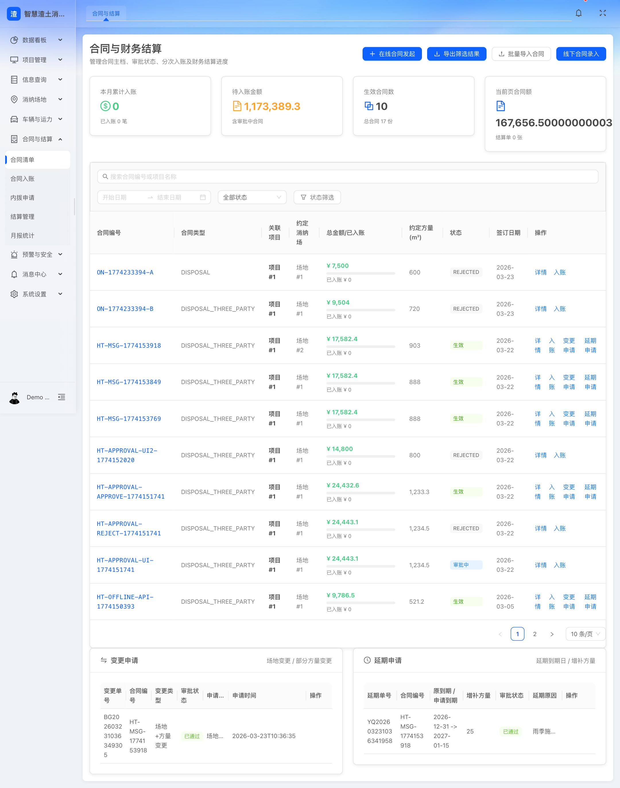
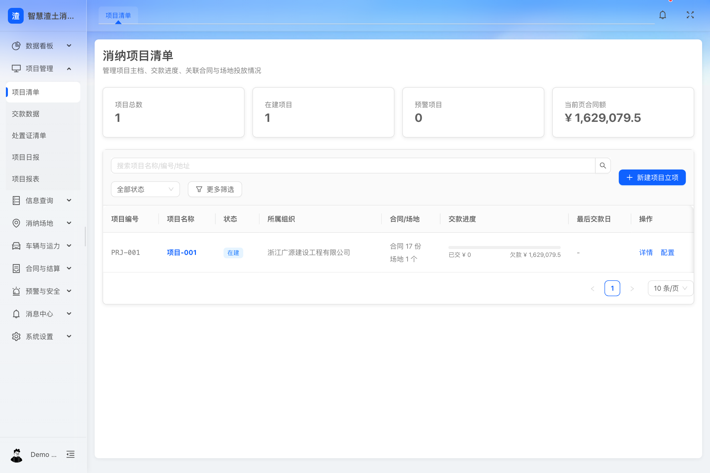
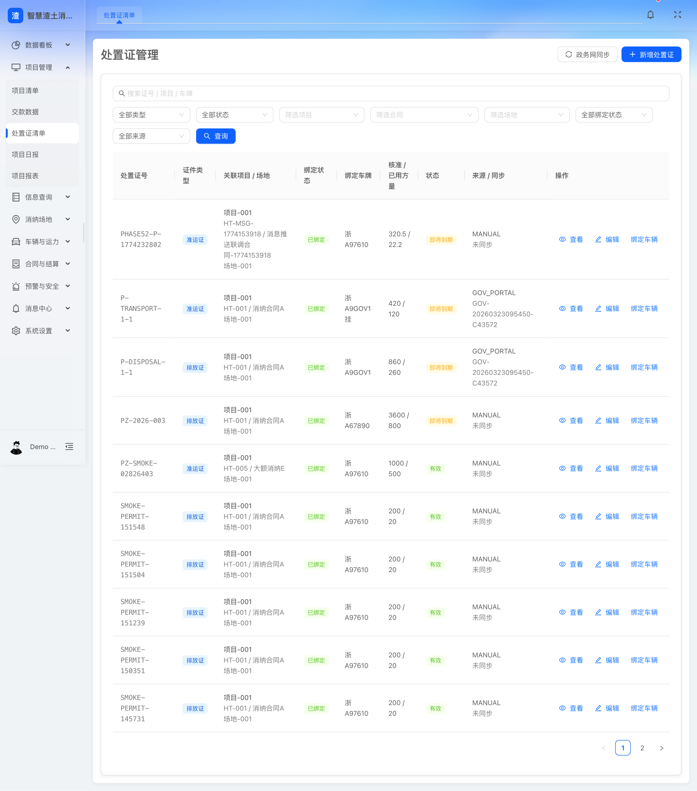
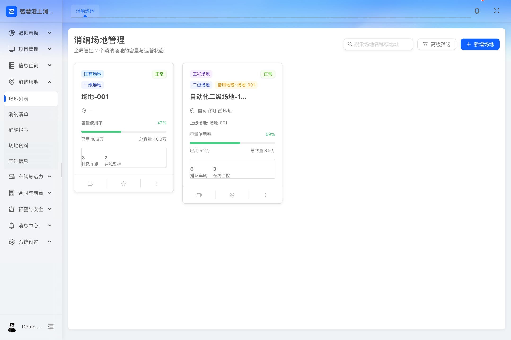
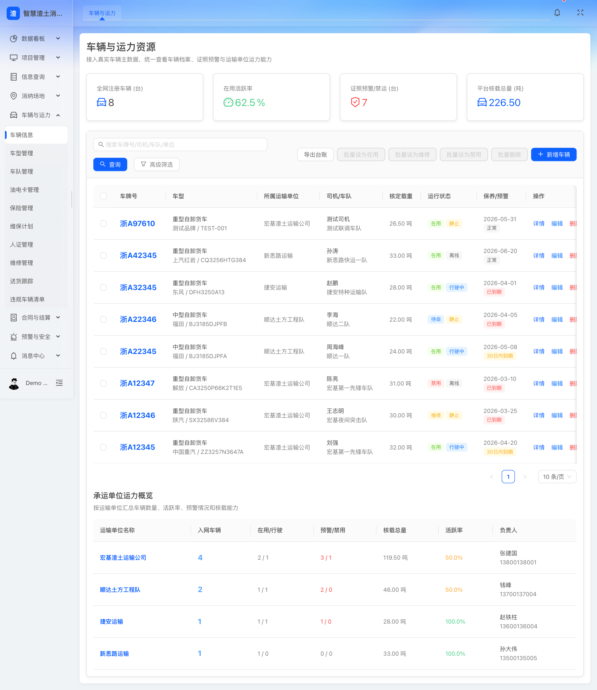
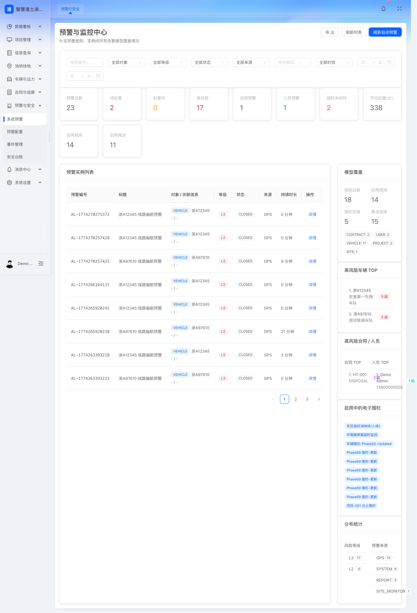
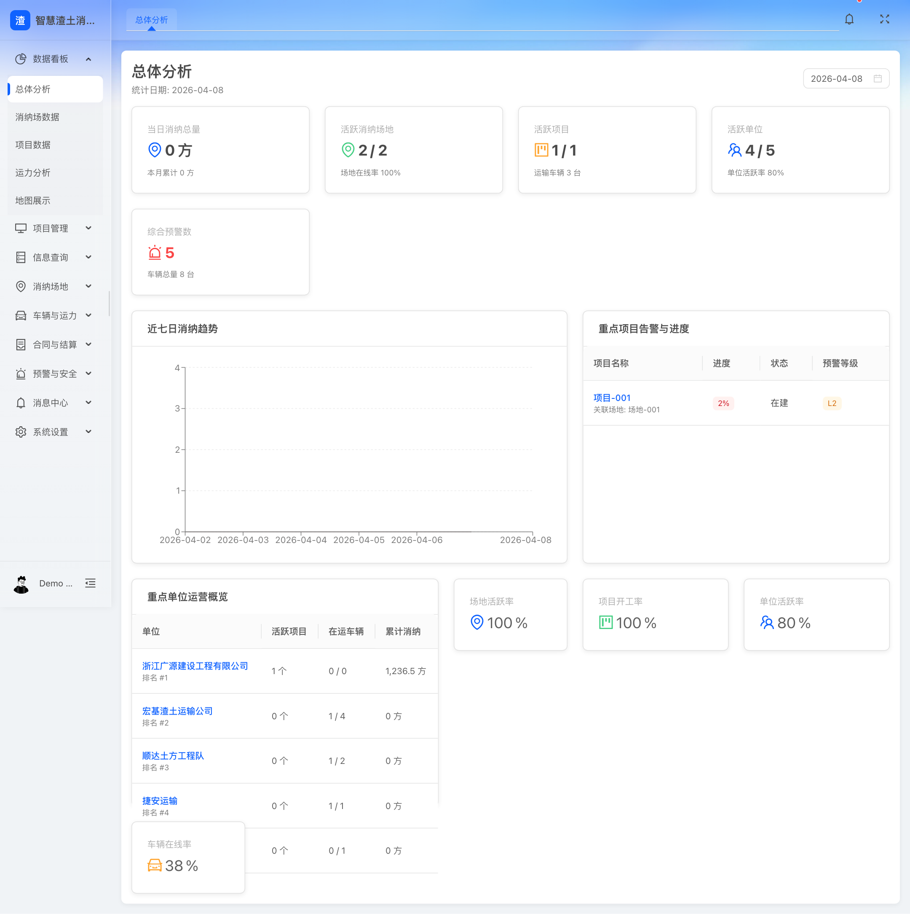

# 第7章 核心功能模块完整性

## 7.0 本章响应说明
本章围绕招标文件对“核心功能模块完整性”的评分要求进行编制，重点说明平台对合同结算管理、项目管理、处置证管理、消纳场地管理、车辆管理、预警管理、统计分析、数据看板等核心模块的覆盖完整性、业务流程完整性、角色覆盖完整性和页面支撑情况，确保甲方能够直观判断本方案对核心业务的承接能力。

## 7.0.1 本章高分响应摘要
1. 以核心模块覆盖矩阵方式直接回应评标关注点，快速体现“模块齐全”。
2. 从经营主线、监管主线、现场作业主线三个角度说明流程闭环，突出“流程完整”。
3. 对合同、项目、处置证、场地、车辆、预警、统计、看板等核心模块逐项说明完整性，突出“细节详实”。
4. 配套真实系统页面截图，进一步证明现阶段平台已具备较强的模块落地基础。

评分关键词：模块齐全、流程闭环、角色覆盖完整、页面支撑充分。

## 7.1 核心模块覆盖矩阵
| 核心模块 | 一级目标 | 已覆盖关键能力 | 流程闭环情况 | 角色覆盖情况 |
|---|---|---|---|---|
| 合同结算管理 | 建立经营与结算闭环 | 合同清单、合同详情、导入导出、入账、审批、变更、延期、项目结算、场地结算、月报统计、单位统计 | 覆盖“建档-审批-执行-结算-统计”闭环 | 监管、运营、财务、企业管理人员 |
| 项目管理 | 建立源头主数据与规则配置中心 | 项目清单、交款数据、关联合同、关联场地、处置证清单、项目日报、打卡配置、位置判断、线路配置、报表统计、违规配置 | 覆盖“建档-配置-采集-统计-预警”闭环 | 监管、项目管理员、运营人员 |
| 处置证管理 | 建立证照准入与联动管理 | 处置证同步、手工新增、业务关联、有效性校验 | 覆盖“同步/录入-关联-校验-使用”闭环 | 审批协同人员、监管人员、项目管理员 |
| 消纳场地管理 | 建立场地运营与现场核验闭环 | 场地列表、消纳清单、资料、基础信息、结算、报表、场地创建、测绘、设备配置、运营配置、人员配置、安全管理 | 覆盖“建档-配置-接收-确认-结算-分析”闭环 | 场地方、监管方、现场值守人员 |
| 车辆管理 | 建立人车队全过程管理 | 车辆信息、车型、车队、保险、维修、维保、调度、油电卡、人证、财务、报表、轨迹跟踪、违规车辆清单 | 覆盖“建档-调度-执行-监管-维保-统计”闭环 | 运输单位、车队管理员、监管人员 |
| 预警管理 | 建立风险识别与处置闭环 | 场地预警、项目预警、人员预警、车辆预警、合同预警、规则配置、事件联动、消息推送 | 覆盖“识别-通知-处置-反馈-考核”闭环 | 监管人员、运营值守、领导管理者 |
| 统计分析 | 建立经营监管分析能力 | 合同统计、项目统计、场地统计、车辆统计、预警统计、专题报表 | 覆盖“汇总-分析-导出-复盘”闭环 | 领导层、运营管理层、监管人员 |
| 数据看板 | 建立综合展示与领导驾驶舱 | 总体分析、项目数据、场地数据、地图展示、运力分析、风险展示 | 覆盖“总览-钻取-联动-专题”闭环 | 领导层、监管人员、运营人员 |

## 7.2 核心模块完整性说明

### 7.2.1 合同结算管理模块完整性
合同结算模块围绕“合同主档、过程审批、执行跟踪、经营结算、统计输出”五个层面构建完整能力，既满足甲方经营管理要求，也满足对合同执行与场地消纳关系的过程监管要求。

| 功能项 | 模块完整性说明 |
|---|---|
| 合同清单/详情 | 支撑多状态、多类型合同统一台账与详情展示 |
| 合同入账 | 支撑财务确认和账务留痕 |
| 导入导出 | 支撑历史数据迁移和规范化输出 |
| 合同审批 | 支撑合同发起、审批、驳回、回写 |
| 变更/延期/内拨 | 支撑合同过程变更管理 |
| 项目结算/场地结算 | 支撑按项目和按场地的双视角结算 |
| 月报/单位统计 | 支撑经营分析和管理复盘 |

### 7.2.2 项目管理模块完整性
项目管理模块已经覆盖项目主数据、业务关系、规则配置、日常运行和统计输出等关键层面，能够作为全平台业务主线承接合同、处置证、场地、车辆、打卡和预警等模块联动。

| 功能项 | 模块完整性说明 |
|---|---|
| 项目清单 | 管理项目基础台账与状态 |
| 交款数据 | 支撑经营进度跟踪 |
| 合同/场地/处置证清单 | 支撑项目维度关联分析 |
| 项目日报 | 支撑项目日常运行监管 |
| 打卡配置/位置判断/线路配置 | 支撑项目级现场监管规则 |
| 违法清单/违规配置 | 支撑项目级风险识别与追踪 |
| 报表统计 | 支撑项目复盘与考核 |

### 7.2.3 处置证管理模块完整性
处置证管理模块虽然业务点数量不多，但属于关键准入模块。模块方案完整覆盖外部同步、手工补录、业务关联和状态校验四项核心能力，能够满足甲方对证照联动的核心要求。

### 7.2.4 消纳场地管理模块完整性
场地模块覆盖面广，是本平台最具现场运营属性的模块之一。方案已覆盖场地主档、资料档案、设备接入、消纳清单、结算报表、容量管理、安全管理和运营配置等关键能力，能够支撑“场地建档-现场核验-容量监管-经营结算”的完整闭环。

### 7.2.5 车辆管理模块完整性
车辆管理模块覆盖车辆、车型、车队、保险、维保、维修、调度、人证、油电卡、财务和报表等高频业务要素，并与定位跟踪和违规车辆清单联动，完整承接运输单位的日常运营管理与监管协同需求。

### 7.2.6 预警管理模块完整性
预警管理模块不仅覆盖多类型预警监控，还通过预警配置、消息推送、事件处置等支撑能力，形成从识别到闭环的监管链路，满足甲方“异常数据预警推送及数据服务输出”的建设目标。

### 7.2.7 统计分析模块完整性
统计分析模块覆盖合同、项目、场地、车辆、预警等核心维度，并支持导出和专题研判，能够支撑监管考核、经营分析和领导决策三类典型使用场景。

### 7.2.8 数据看板模块完整性
数据看板模块覆盖总体分析、项目数据、场地数据、地图展示和运力分析等核心专题，既能满足领导驾驶舱展示，也能满足监管人员专题钻取和重点对象追踪。

## 7.3 核心模块业务流程完整性

### 7.3.1 经营主线流程
项目立项 -> 合同签订 -> 处置证联动 -> 场地投放 -> 运输执行 -> 称重核验 -> 消纳确认 -> 项目/场地结算 -> 统计分析。

### 7.3.2 监管主线流程
项目建档 -> 规则配置 -> 现场打卡/轨迹采集 -> 异常识别 -> 预警推送 -> 事件处置 -> 统计考核 -> 执法追溯。

### 7.3.3 现场作业主线流程
现场人员登录移动端 -> 出土打卡/拍照 -> 车辆进出场核验 -> 消纳确认 -> 异常上报 -> 后台联动监管和统计。

## 7.4 核心模块页面支撑说明
本章配套核心模块页面截图，形成“功能完整 + 页面可视”的双重证明。当前系统已形成以下展示内容：

| 插图编号 | 对应页面 | 展示重点 |
|---|---|---|
| 图7-1 | 合同清单/结算页面 | 展示合同状态、入账、审批、结算和统计 |
| 图7-2 | 项目管理页面 | 展示项目台账、交款进度、配置能力 |
| 图7-3 | 处置证页面 | 展示证件清单、来源、状态和项目/合同/场地关联关系 |
| 图7-4 | 消纳场地页面 | 展示场地运营状态、容量、设备配置 |
| 图7-5 | 车辆管理页面 | 展示车辆台账、运力统计、状态监管 |
| 图7-6 | 预警监控页面 | 展示多类预警与处置状态 |
| 图7-7 | 数据看板页面 | 展示可视化图表和地图专题 |

### 图7-1 合同结算模块页面

### 图7-2 项目管理模块页面

### 图7-3 处置证管理模块页面

### 图7-4 消纳场地模块页面

### 图7-5 车辆管理模块页面

### 图7-6 预警管理模块页面

### 图7-7 数据看板模块页面

图示说明：以上截图均为现阶段系统真实页面，重点展示核心模块在台账管理、过程监管、预警识别和综合展示方面的完整承载能力。

## 7.5 对评分项的直接响应
综合上述内容，本方案对招标文件要求的合同结算管理、项目管理、处置证管理、消纳场地管理、车辆管理、预警管理、统计分析和数据看板等核心模块均已进行完整覆盖，业务链路清晰，角色范围明确，流程前后衔接完整，且具备较强的页面支撑和实施落地基础，能够满足甲方对“功能模块齐全、流程完整、细节详实”的评分要求。

本章投标响应结论：投标人所提供的功能方案已形成从主数据、过程管控、风险识别到可视化展示的完整模块体系，能够有效支撑甲方对核心业务模块完整性的评审要求。
