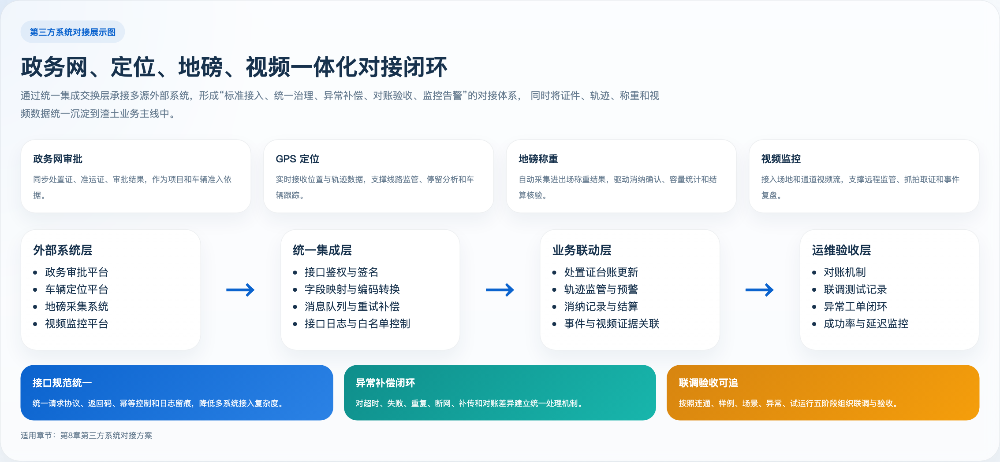

# 第8章 第三方系统对接方案

## 8.0 本章响应说明
本章围绕招标文件中与政务网、GPS 车辆定位、地磅称重、视频监控等第三方系统的对接要求进行编制，重点说明对接范围、接口规范、业务流程、异常处理机制、对账机制和运维保障要求，确保方案完整、规范、可实施。

## 8.0.1 本章高分响应摘要
1. 对政务网、GPS、地磅、视频、统一认证五类外部系统进行全量覆盖，不遗漏甲方要求的重点对接对象。
2. 对每类对接分别说明目标、接口规范、业务流程和异常处理，体现方案完整性和规范性。
3. 补充统一接口规范、补偿机制、对账监控、联调实施和验收指标，增强可实施性与可验收性。
4. 配置展示型总图，帮助评审快速理解“统一接入、统一治理、统一验收”的对接思路。

评分关键词：对接范围完整、接口规范统一、异常补偿健全、联调验收可落地。

## 8.1 对接建设原则
1. 统一接口规范：统一请求方式、编码规则、签名鉴权、返回码、日志留痕。
2. 统一交换中心：所有第三方系统均通过平台集成层接入，避免业务模块各自直连。
3. 统一异常治理：建立重试、补偿、人工介入、对账和告警机制。
4. 统一安全策略：全链路认证鉴权、数据脱敏、接口访问控制和审计留痕。

## 8.2 对接范围总览
| 对接系统 | 对接目标 | 主要交换内容 |
|---|---|---|
| 政务网/审批系统 | 同步处置证、准运证、审批结果 | 证件主档、状态、有效期、关联主体 |
| GPS 车辆定位系统 | 获取车辆实时位置和历史轨迹 | 车辆编号、坐标、速度、方向、定位时间 |
| 地磅称重系统 | 获取车辆进出场称重数据 | 车牌、进场时间、出场时间、毛重、皮重、净重、磅单号 |
| 视频监控系统 | 获取视频流、截图、事件联动信息 | 摄像头编号、视频地址、抓拍地址、事件标记 |
| 统一认证/政务账号体系 | 实现单点登录和统一身份协同 | 用户身份、组织、角色、授权票据 |

### 图8-1 第三方系统对接总体展示图

图示说明：该图用于集中展示外部系统、统一集成层、业务联动层和联调验收层之间的整体关系，便于评审快速理解本章技术路线。

## 8.3 政务网对接方案

### 8.3.1 对接目标
实现处置证、准运证等审批结果数据与本平台同步，确保项目、车辆、场地和证件信息保持一致，避免人工重复录入和证照状态滞后。

### 8.3.2 接口规范
1. 对接方式支持 API 调用、定时拉取、文件交换或消息通知。
2. 接口请求统一采用 HTTPS；支持 Token、签名或政务专网认证方式。
3. 接口字段遵循统一编码规则，重点保证证件编号、项目编号、车辆标识、有效期和状态码口径一致。
4. 同步结果保留接口流水号、同步时间、源系统标识和结果码。

### 8.3.3 业务流程
政务审批系统产生证件数据 -> 集成层接收或主动拉取 -> 数据标准化转换 -> 写入证件台账 -> 触发关联校验 -> 更新业务状态 -> 记录同步日志。

### 8.3.4 异常处理机制
1. 接口超时或网络异常时按策略自动重试。
2. 单笔数据校验失败时进入异常队列，支持人工复核后再次同步。
3. 关键证件状态变更失败时触发消息告警和运维告警。
4. 日常按证件编号和更新时间进行增量对账，防止漏同步。

## 8.4 GPS 车辆定位对接方案

### 8.4.1 对接目标
实现车辆实时位置、历史轨迹、离线状态、轨迹偏离等数据接入，为车辆监管、线路判断、预警管理和车辆跟踪提供基础支撑。

### 8.4.2 接口规范
1. 接入方式支持厂商开放 API、MQ 推送、标准 JT/T 协议网关转换等模式。
2. 关键字段包括车辆编号、车牌号、坐标、速度、方向、设备状态、采集时间。
3. 坐标系统一转换并记录来源坐标系，保证地图展示一致。
4. 轨迹数据按时间分段存储，支持实时查询和历史回放。

### 8.4.3 业务流程
定位设备上报 -> 第三方定位平台汇聚 -> 本平台集成层接收 -> 数据清洗与坐标转换 -> 实时监管/轨迹查询/预警分析。

### 8.4.4 异常处理机制
1. 车辆连续离线、数据延迟、坐标异常、设备重复报码时自动告警。
2. 短时丢包支持数据补传和轨迹拼接。
3. 轨迹数据异常不直接覆盖原始数据，保留原始上报值供复核。

## 8.5 地磅称重对接方案

### 8.5.1 对接目标
实现车辆进出场称重数据自动上传，支撑无纸化核验、消纳确认、容量统计、合同结算和异常识别。

### 8.5.2 接口规范
1. 支持串口采集网关、地磅软件数据库读取、API 推送等多种接入方式。
2. 关键字段包括磅单号、车牌号、进场时间、出场时间、毛重、皮重、净重、场地编号、图片附件。
3. 地磅数据需具备唯一流水号，支持防重处理和补传处理。

### 8.5.3 业务流程
车辆进场 -> 地磅称重 -> 称重结果上传 -> 与车辆、项目、场地进行关联匹配 -> 生成消纳记录 -> 参与结算与统计。

### 8.5.4 异常处理机制
1. 称重数据缺字段、重量异常或重复流水时进入待核验队列。
2. 地磅断网时支持本地缓存，恢复后自动补传。
3. 称重结果与现场确认不一致时触发复核预警。

## 8.6 视频监控对接方案

### 8.6.1 对接目标
实现消纳场、通道、关键作业点的视频接入和事件留痕，支撑远程监管、现场核验、异常取证和事件复盘。

### 8.6.2 接口规范
1. 支持国标视频平台、厂家私有协议网关转换、RTSP/FLV/HLS 地址接入等模式。
2. 支持摄像头基础信息同步、实时流地址获取、抓拍地址调用和录像回放地址关联。
3. 支持视频通道与场地、出入口、地磅和事件点位进行绑定。

### 8.6.3 业务流程
视频平台接入 -> 摄像头台账同步 -> 设备绑定场景 -> 页面实时播放/抓拍 -> 事件关联存证。

### 8.6.4 异常处理机制
1. 视频流失效、设备离线或取流失败时自动告警。
2. 对接故障不影响核心业务台账生成，但保留“视频缺失”状态供后续追溯。
3. 抓拍失败可重试或回退至人工补传附件。

## 8.7 统一认证与单点登录对接方案

### 8.7.1 对接目标
满足政务内网或统一认证体系下的用户身份协同，减少重复登录，提高账号统一管理能力。

### 8.7.2 对接流程
统一认证平台签发票据 -> 本平台校验票据 -> 映射租户、组织、用户和角色 -> 签发本平台会话令牌 -> 记录登录审计日志。

### 8.7.3 异常处理机制
票据失效、用户未开通、组织映射缺失时返回明确提示并记录异常日志，避免无权限用户直接进入业务页面。

## 8.8 统一接口规范
| 规范项 | 方案要求 |
|---|---|
| 请求协议 | HTTPS/REST 为主，必要时支持文件交换和消息订阅 |
| 数据格式 | JSON 为主，字段命名统一，时间统一为标准时间格式 |
| 鉴权方式 | Token、签名、时间戳、防重放、白名单控制 |
| 返回格式 | 统一状态码、错误码、错误信息、请求流水号 |
| 幂等控制 | 关键写入接口以业务唯一号防止重复写入 |
| 日志留痕 | 请求、响应、耗时、调用方、结果码全量记录 |

## 8.9 异常处理与补偿机制
1. 对接失败自动重试，超过阈值进入人工处理队列。
2. 对关键业务数据采用“先落原始流水、后做业务转换”的方式，防止源数据丢失。
3. 对定时拉取类接口建立增量同步点和补采机制。
4. 对推送类接口建立消费确认和失败回执机制。
5. 对重要对接场景建立日对账和异常差异清单。

## 8.10 对账与监控机制
### 8.10.1 对账机制
1. 政务证件按编号、状态、更新时间对账。
2. GPS 轨迹按车辆、时间段、点位数量对账。
3. 地磅数据按磅单号、车牌、时间、净重对账。
4. 视频设备按设备在线率、流状态、抓拍成功率对账。

### 8.10.2 运维监控要求
1. 对接口成功率、超时率、失败率建立实时监控。
2. 对设备在线率、数据延迟、积压队列建立告警。
3. 对外部系统不可用、证件同步中断、称重补传积压等关键事件建立短信/站内消息通知。

## 8.11 联调实施与验收方案

### 8.11.1 联调前置条件
1. 明确双方接口责任边界、字段口径、时间格式和状态码定义。
2. 提前准备测试环境、测试账号、白名单、设备编号和样例数据。
3. 明确接口提供方、接口调用方、异常处理联系人和联调窗口期。

### 8.11.2 联调阶段划分
| 阶段 | 目标 | 输出物 |
|---|---|---|
| 第一阶段 | 接口连通性验证 | 联通测试记录、签名和鉴权验证结果 |
| 第二阶段 | 样例数据联调 | 样例报文、字段映射确认单、问题清单 |
| 第三阶段 | 业务场景联调 | 证件同步、轨迹接入、称重回传、视频取流等场景测试记录 |
| 第四阶段 | 异常与补偿验证 | 超时、重试、补传、对账、告警测试记录 |
| 第五阶段 | 试运行与验收 | 联调验收报告、问题关闭清单、运行确认单 |

### 8.11.3 验收指标
1. 核心接口联通率达到 100%。
2. 样例数据字段映射准确率达到 100%。
3. 正常业务场景下核心接口成功率不低于 99%。
4. 异常补偿机制、重试机制和对账机制均完成验证。
5. 联调问题形成闭环台账，全部完成处理或达成书面确认。

## 8.12 本章结论
本方案已对政务网、GPS 车辆定位、地磅称重、视频监控及统一认证等第三方系统给出完整对接设计，覆盖对接目标、接口规范、业务流程、异常处理、对账机制和运维监控要求，能够满足甲方对“方案清晰、完整、规范，异常处理机制完善”的评分要求。

本章投标响应结论：投标人具备将政务审批、车辆定位、称重设备和视频系统统一纳入平台治理体系的能力，可实现对接规范化、联调有章法、异常可补偿、结果可验收。
