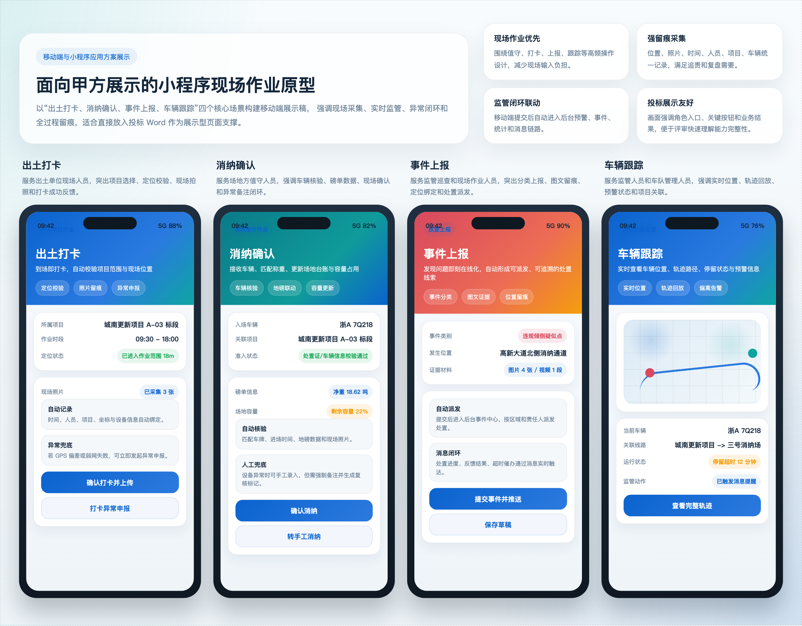
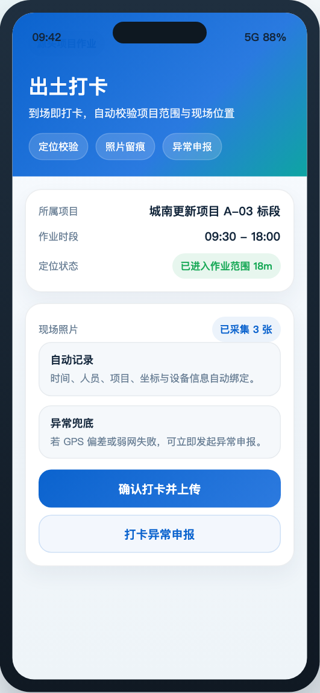
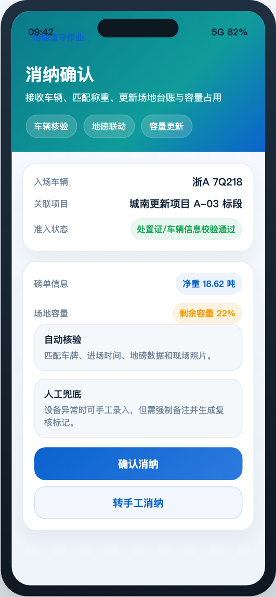
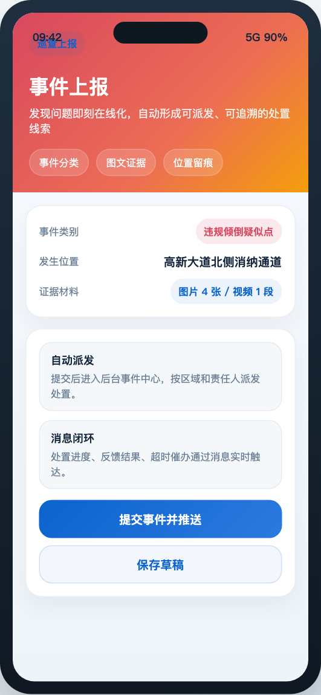
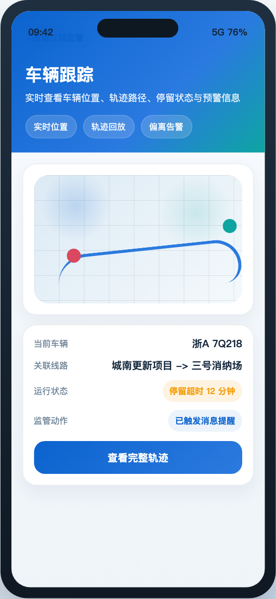

# 第9章 移动端与小程序应用方案

## 9.0 本章响应说明
本章围绕招标文件对“小程序移动端方案”的评分要求进行编制，重点说明移动端建设目标、使用角色、业务场景、功能覆盖、业务流程、交互原则、弱网与异常处理机制，以及与后台监管平台的协同关系，确保移动端能力不遗漏、不空泛、可落地。

## 9.0.1 本章高分响应摘要
1. 以现场高频业务为中心，重点覆盖出土打卡、消纳确认、事件上报、车辆跟踪四个甲方最关注场景。
2. 对小程序功能点进行全量归纳，不遗漏账号绑定、异常申报、问题反馈、安全教育和统计查询等辅助能力。
3. 从角色、流程、弱网、终端边界和后台协同五个方面说明移动端可实施性，避免仅停留在功能描述层。
4. 配置展示型移动端原型图，增强本章的直观展示效果和标书观感。

评分关键词：移动场景完整、角色覆盖充分、弱网可用、现场留痕清晰、展示效果直观。

## 9.1 移动端建设目标
移动端不是 PC 端的简单延伸，而是现场业务数字化的关键落点。平台移动端建设目标主要包括：

1. 将出土打卡、消纳确认、事件上报等现场高频动作从纸质和口头流转转为在线留痕。
2. 将定位、拍照、时间戳、附件和业务对象关联起来，形成可追责的现场数据证据链。
3. 将车辆跟踪、异常申报、统计查询等能力下沉到现场，提高协同效率。
4. 在弱网、复杂现场环境下保证操作简洁、信息准确和数据可回传。

## 9.2 使用角色与典型场景
| 角色 | 典型使用场景 | 移动端重点能力 |
|---|---|---|
| 出土单位现场人员 | 出土打卡、出土拍照、异常申报 | 定位打卡、照片上传、项目选择 |
| 场地方值守人员 | 车辆进场确认、消纳确认、手动消纳 | 快速核验、称重校对、附件留痕 |
| 监管巡查人员 | 事件上报、车辆检查、轨迹查询 | 事件上报、车辆实时查询、异常反馈 |
| 运输单位管理人员 | 车辆跟踪、调度查询、统计查看 | 实时位置、状态查看、报表查询 |
| 普通用户 | 登录、账号绑定、密码修改、问题反馈 | 账户管理、消息反馈 |

## 9.3 小程序功能覆盖说明
结合招标文件功能点，小程序方案覆盖以下功能：

| 功能项 | 业务价值 |
|---|---|
| 消纳清单 | 现场快速查看已发生或待确认的消纳记录 |
| 事件上报 | 第一时间上报异常事件、违规线索和现场问题 |
| 出土单位 | 查看项目、出土信息和相关作业任务 |
| 出土拍照 | 对出土现场、车辆、物料情况进行拍照取证 |
| 打卡异常申报 | 对无法正常打卡、位置偏差、网络异常等进行申报 |
| 消纳场 | 查看场地基础信息、运营状态和接收情况 |
| 手动消纳 | 对特殊场景进行人工补录和确认 |
| 延期申报 | 对合同或作业延期进行在线申报 |
| 统计报表 | 查看项目、场地、车辆等移动端统计信息 |
| 密码修改 | 满足账号安全管理要求 |
| 账号绑定 | 实现手机号、员工身份、平台账号的绑定 |
| 问题反馈 | 上报使用问题或流程问题 |
| 登录 | 支撑账号登录、验证码登录或统一认证登录 |
| 车辆检查 | 对车辆、驾驶员、人证等进行巡查核验 |
| 车辆实时查询 | 查看车辆实时位置和状态 |
| 安全教育 | 承载现场培训、安全宣导和学习记录 |

## 9.4 核心业务场景方案

### 9.4.1 出土打卡方案
出土打卡面向出土单位现场人员，目标是在项目源头形成规范、可信、可核验的出土记录。

#### 业务流程
用户登录 -> 选择项目/作业对象 -> 获取当前位置 -> 拍照/填写说明 -> 提交打卡 -> 后台校验位置与规则 -> 成功留痕或提示异常申报。

#### 关键能力
1. 自动获取定位信息并校验是否在允许范围内。
2. 自动记录打卡时间、人员、项目和附件。
3. 对异常定位、弱网、无法提交等场景提供异常申报入口。

### 9.4.2 消纳确认方案
消纳确认面向场地方值守人员，目标是将车辆进场、称重、现场确认和消纳记录进行统一留痕。

#### 业务流程
扫描/选择车辆 -> 获取称重信息或手工补录 -> 现场拍照 -> 确认消纳 -> 后台写入消纳记录 -> 更新场地容量与统计。

#### 关键能力
1. 支持与地磅数据联动，提高效率。
2. 支持手工消纳兜底，满足设备异常场景。
3. 支持照片、备注、异常标记与后台预警联动。

### 9.4.3 事件上报方案
事件上报面向监管巡查和现场作业人员，目标是将现场发现的问题即时在线化。

#### 业务流程
选择事件类型 -> 填写描述 -> 拍照/录像/定位 -> 提交事件 -> 后台派发 -> 处置反馈 -> 闭环归档。

#### 关键能力
1. 事件类型可配置。
2. 附件、位置和时间自动绑定。
3. 支持消息提醒和处置结果回看。

### 9.4.4 车辆跟踪方案
车辆跟踪面向监管人员和运输单位管理人员，目标是对运输过程进行移动查看。

#### 业务流程
输入或选择车辆 -> 查看实时位置 -> 查看历史轨迹 -> 查看预警状态和关联项目/场地。

#### 关键能力
1. 支持车辆实时位置查看。
2. 支持历史轨迹回放和异常状态显示。
3. 支持与预警、违规清单联动。

## 9.5 移动端交互与体验设计原则
1. 角色化首页：不同角色展示不同常用入口，减少误操作。
2. 少步骤录入：现场操作原则上控制在 3 至 5 步内完成。
3. 强校验提示：对定位失败、必填项缺失、附件不足等实时提示。
4. 大按钮和高对比度设计：适应现场光线和手套操作环境。
5. 消息驱动协同：预警、待办、审批、处置通过移动消息及时触达。

## 9.6 弱网、异常与安全机制

### 9.6.1 弱网处理机制
1. 支持临时离线缓存和恢复后自动补传。
2. 对图片和附件上传采用分片或失败重试机制。
3. 对定位获取超时提供人工重试和异常申报入口。

### 9.6.2 异常处理机制
1. 打卡超范围时提示原因并允许发起异常申报。
2. 消纳确认时称重缺失可转人工兜底，但需强制备注。
3. 事件上报资料不完整时阻止提交，保证现场取证质量。

### 9.6.3 账号与数据安全
1. 支持密码修改、账号绑定、登录失效控制。
2. 移动端接口统一鉴权，敏感数据按角色展示。
3. 对关键移动操作保留时间、位置、人员和设备标识留痕。

### 9.6.4 终端能力边界与实施要求
为保证移动端方案可落地，平台对终端能力边界和交付要求明确如下：

| 能力项 | 实施要求 |
|---|---|
| 定位能力 | 支持持续定位、单次定位、定位失败重试和定位异常申报 |
| 拍照上传 | 支持现场拍照、水印信息、失败重传和压缩上传 |
| 消息提醒 | 支持站内待办、预警消息和业务通知触达 |
| 身份认证 | 支持账号登录、验证码登录或统一认证接入 |
| 弱网补偿 | 支持离线暂存、恢复后补传和提交状态回执 |
| 附件留痕 | 支持图片、说明、时间、地点、人员的统一留痕 |
| 终端适配 | 适配常见安卓终端和微信小程序运行环境 |

## 9.7 与后台平台协同关系
移动端负责现场采集和快速确认，后台平台负责规则校验、集中监管、预警分析、统计展示和处置闭环。两者关系如下：

| 现场端动作 | 后台联动结果 |
|---|---|
| 出土打卡 | 更新项目作业记录，参与统计和预警判断 |
| 消纳确认 | 更新消纳台账、场地容量、结算和报表 |
| 事件上报 | 进入事件中心并触发派发和消息 |
| 车辆检查/查询 | 关联车辆台账、轨迹和违规信息 |
| 问题反馈 | 进入平台问题反馈或服务工单流程 |

## 9.8 移动端页面支撑说明
本章配套移动端和小程序展示图，突出甲方关注的核心现场能力：

| 插图编号 | 对应页面 | 展示重点 |
|---|---|---|
| 图9-1 | 小程序核心场景总览 | 展示四类核心移动业务统一展示效果 |
| 图9-2 | 出土打卡页面 | 展示项目选择、定位打卡、拍照留痕 |
| 图9-3 | 消纳确认页面 | 展示车辆确认、称重信息、确认提交 |
| 图9-4 | 事件上报页面 | 展示事件类别、附件上传、定位上报 |
| 图9-5 | 车辆跟踪页面 | 展示实时位置、轨迹和状态查看 |

### 9.8.1 移动端交付说明
本项目移动端以微信小程序为主要交付形态，结合现场作业场景同步输出页面原型、交互说明和正式开发版本。本章所附展示图用于直观体现移动端在现场作业、监管协同和异常闭环方面的交付能力。

### 图9-1 小程序核心场景总览

### 图9-2 出土打卡展示页

### 图9-3 消纳确认展示页

### 图9-4 事件上报展示页

### 图9-5 车辆跟踪展示页

图示说明：以上移动端展示图为面向甲方评审的展示型页面原型，重点体现小程序在现场作业、监管协同和异常闭环方面的交互承载能力。

## 9.9 本章结论
本方案移动端与小程序设计已覆盖招标文件要求的出土打卡、消纳确认、事件上报、车辆跟踪等核心功能，同时补充账号绑定、异常申报、问题反馈、安全教育、统计查询等现场协同能力，并对角色场景、业务流程、交互原则、弱网策略和安全机制进行了完整设计，能够满足甲方对移动端方案“内容清晰、完整、合理可行”的评分要求。

本章投标响应结论：投标人提供的小程序方案能够把甲方关注的现场业务真正落到移动端，既满足现场作业效率，也满足监管留痕和异常闭环要求。
