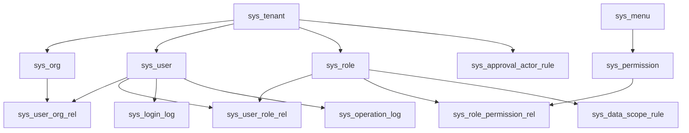

# 用户体系 ER/DDL 设计文档

## 1. 文档定位

本文件面向数据库设计评审，聚焦：

- 领域边界与 ER 关系
- 表结构草案
- 约束与索引策略
- 租户隔离与数据权限落位
- 风险与迁移顺序

共享命名、枚举和值域规则统一引用 `00-shared-model.md`。

## 2. 设计目标

- 支撑 `xngl-web` 当前登录、组织人员、角色权限、审批配置、系统日志页面
- 形成 `平台监管 + 企业/单位边界隔离 + 租户内组织树授权` 的统一模型
- 为菜单权限、按钮权限、接口权限、数据权限提供独立可扩展的表结构
- 为审批配置提供统一参与人规则，不把选人逻辑散落到业务表

## 3. ER 总览

关系原则：

- `tenant -> org/user/role` 是隔离主轴
- `user <-> org` 支持多组织挂接
- `user <-> role` 支持多角色聚合
- `menu` 管树，`permission` 管权限点
- `data_scope_rule` 单独建模，不混入角色 JSON
- `approval_actor_rule` 独立于业务表

## 4. 核心表清单

| 表名 | 用途 | 是否带 `tenant_id` |
| --- | --- | --- |
| `sys_tenant` | 租户主档 | 否 |
| `sys_org` | 组织树 | 是 |
| `sys_user` | 用户主档 | 是 |
| `sys_user_org_rel` | 用户组织关系 | 是 |
| `sys_role` | 角色主档 | 是 |
| `sys_user_role_rel` | 用户角色关系 | 是 |
| `sys_menu` | 菜单树与路由定义 | 否，使用 `tenant_scope` |
| `sys_permission` | 权限点 | 否，使用 `tenant_scope` |
| `sys_role_permission_rel` | 角色权限关系 | 是 |
| `sys_data_scope_rule` | 角色数据权限规则 | 是 |
| `sys_approval_actor_rule` | 审批参与人规则 | 是 |
| `sys_login_log` | 登录日志 | 是 |
| `sys_operation_log` | 操作日志 | 是 |

## 5. 逐表 DDL 草案

以下为字段级设计草案，偏实现前冻结稿，不与当前 `baseline.sql` 强绑定，但应作为后续正式 DDL 的依据。

### 5.1 `sys_tenant`

用途：租户/企业边界。

| 字段 | 类型建议 | 非空 | 默认值 | 说明 |
| --- | --- | --- | --- | --- |
| `id` | `bigint unsigned` | 是 |  | 主键 |
| `tenant_code` | `varchar(64)` | 是 |  | 租户编码，唯一 |
| `tenant_name` | `varchar(128)` | 是 |  | 租户名称 |
| `tenant_type` | `varchar(32)` | 是 |  | 见共享枚举 |
| `status` | `varchar(16)` | 是 | `'ENABLED'` | 状态 |
| `contact_name` | `varchar(64)` | 否 | `null` | 联系人 |
| `contact_mobile` | `varchar(32)` | 否 | `null` | 联系电话 |
| `business_license_no` | `varchar(64)` | 否 | `null` | 营业执照号 |
| `address` | `varchar(255)` | 否 | `null` | 地址 |
| `expire_time` | `datetime` | 否 | `null` | 到期时间 |
| `remark` | `varchar(500)` | 否 | `null` | 备注 |
| `create_time` | `datetime` | 是 | `CURRENT_TIMESTAMP` | 创建时间 |
| `update_time` | `datetime` | 是 | `CURRENT_TIMESTAMP` | 更新时间 |
| `deleted` | `tinyint(1)` | 是 | `0` | 逻辑删除 |

约束与索引：

- `uk_sys_tenant_code(tenant_code)`
- `idx_sys_tenant_type_status(tenant_type, status)`

### 5.2 `sys_org`

用途：租户内组织树。

| 字段 | 类型建议 | 非空 | 默认值 | 说明 |
| --- | --- | --- | --- | --- |
| `id` | `bigint unsigned` | 是 |  | 主键 |
| `tenant_id` | `bigint unsigned` | 是 |  | 租户 ID |
| `org_code` | `varchar(64)` | 是 |  | 组织编码 |
| `org_name` | `varchar(128)` | 是 |  | 组织名称 |
| `parent_id` | `bigint unsigned` | 是 | `0` | 父节点，根为 `0` |
| `org_type` | `varchar(32)` | 是 | `'DEPARTMENT'` | 组织类型 |
| `org_path` | `varchar(1024)` | 否 | `null` | 祖先路径缓存 |
| `leader_user_id` | `bigint unsigned` | 否 | `null` | 负责人用户 ID |
| `leader_name_cache` | `varchar(64)` | 否 | `null` | 负责人姓名快照 |
| `sort_order` | `int` | 是 | `0` | 排序 |
| `status` | `varchar(16)` | 是 | `'ENABLED'` | 状态 |
| `create_time` | `datetime` | 是 | `CURRENT_TIMESTAMP` | 创建时间 |
| `update_time` | `datetime` | 是 | `CURRENT_TIMESTAMP` | 更新时间 |
| `deleted` | `tinyint(1)` | 是 | `0` | 逻辑删除 |

约束与索引：

- `uk_sys_org_tenant_code(tenant_id, org_code)`
- `idx_sys_org_tenant_parent(tenant_id, parent_id)`
- `idx_sys_org_tenant_leader(tenant_id, leader_user_id)`

设计说明：

- 一期采用邻接表，不引入闭包表
- 若后续组织树查询频繁，可追加 `org_path` 或闭包表

### 5.3 `sys_user`

用途：用户主档。

| 字段 | 类型建议 | 非空 | 默认值 | 说明 |
| --- | --- | --- | --- | --- |
| `id` | `bigint unsigned` | 是 |  | 主键 |
| `tenant_id` | `bigint unsigned` | 是 |  | 租户 ID |
| `username` | `varchar(64)` | 是 |  | 登录账号 |
| `password_hash` | `varchar(128)` | 是 |  | BCrypt 密文 |
| `name` | `varchar(64)` | 是 |  | 姓名 |
| `mobile` | `varchar(32)` | 否 | `null` | 手机号 |
| `email` | `varchar(128)` | 否 | `null` | 邮箱 |
| `avatar_url` | `varchar(255)` | 否 | `null` | 头像 |
| `id_card_mask` | `varchar(64)` | 否 | `null` | 脱敏身份证号 |
| `user_type` | `varchar(32)` | 是 | `'EMPLOYEE'` | 用户类型 |
| `main_org_id` | `bigint unsigned` | 否 | `null` | 主组织 |
| `status` | `varchar(16)` | 是 | `'ENABLED'` | 用户状态 |
| `last_login_time` | `datetime` | 否 | `null` | 最近登录时间 |
| `password_expire_time` | `datetime` | 否 | `null` | 密码到期时间 |
| `need_reset_password` | `tinyint(1)` | 是 | `0` | 是否强制重置密码 |
| `lock_status` | `tinyint(1)` | 是 | `0` | 是否锁定 |
| `lock_reason` | `varchar(255)` | 否 | `null` | 锁定原因 |
| `auth_source` | `varchar(32)` | 否 | `null` | 认证来源 |
| `external_user_id` | `varchar(64)` | 否 | `null` | 外部统一认证用户 ID |
| `create_time` | `datetime` | 是 | `CURRENT_TIMESTAMP` | 创建时间 |
| `update_time` | `datetime` | 是 | `CURRENT_TIMESTAMP` | 更新时间 |
| `deleted` | `tinyint(1)` | 是 | `0` | 逻辑删除 |

约束与索引：

- `uk_sys_user_tenant_username(tenant_id, username)`
- `idx_sys_user_tenant_mobile(tenant_id, mobile)`
- `idx_sys_user_tenant_main_org(tenant_id, main_org_id)`
- `idx_sys_user_tenant_status(tenant_id, status)`

### 5.4 `sys_user_org_rel`

用途：用户挂接多个组织。

| 字段 | 类型建议 | 非空 | 默认值 | 说明 |
| --- | --- | --- | --- | --- |
| `id` | `bigint unsigned` | 是 |  | 主键 |
| `tenant_id` | `bigint unsigned` | 是 |  | 租户 ID |
| `user_id` | `bigint unsigned` | 是 |  | 用户 ID |
| `org_id` | `bigint unsigned` | 是 |  | 组织 ID |
| `is_main` | `tinyint(1)` | 是 | `0` | 是否主组织 |
| `create_time` | `datetime` | 是 | `CURRENT_TIMESTAMP` | 创建时间 |

约束与索引：

- `uk_sys_user_org_rel(tenant_id, user_id, org_id)`
- `idx_sys_user_org_rel_org(tenant_id, org_id, user_id)`

### 5.5 `sys_role`

用途：角色主档。

| 字段 | 类型建议 | 非空 | 默认值 | 说明 |
| --- | --- | --- | --- | --- |
| `id` | `bigint unsigned` | 是 |  | 主键 |
| `tenant_id` | `bigint unsigned` | 是 |  | 租户 ID |
| `role_code` | `varchar(64)` | 是 |  | 角色编码 |
| `role_name` | `varchar(64)` | 是 |  | 角色名称 |
| `role_scope` | `varchar(32)` | 是 |  | 平台/租户/业务 |
| `role_category` | `varchar(32)` | 否 | `null` | 分类，如监管/车队/场地 |
| `description` | `varchar(500)` | 否 | `null` | 角色描述 |
| `data_scope_type_default` | `varchar(32)` | 否 | `null` | 默认数据范围 |
| `status` | `varchar(16)` | 是 | `'ENABLED'` | 状态 |
| `builtin_flag` | `tinyint(1)` | 是 | `0` | 是否内置角色 |
| `create_time` | `datetime` | 是 | `CURRENT_TIMESTAMP` | 创建时间 |
| `update_time` | `datetime` | 是 | `CURRENT_TIMESTAMP` | 更新时间 |
| `deleted` | `tinyint(1)` | 是 | `0` | 逻辑删除 |

约束与索引：

- `uk_sys_role_tenant_code(tenant_id, role_code)`
- `idx_sys_role_tenant_scope(tenant_id, role_scope, status)`

### 5.6 `sys_user_role_rel`

用途：用户角色关系。

| 字段 | 类型建议 | 非空 | 默认值 | 说明 |
| --- | --- | --- | --- | --- |
| `id` | `bigint unsigned` | 是 |  | 主键 |
| `tenant_id` | `bigint unsigned` | 是 |  | 租户 ID |
| `user_id` | `bigint unsigned` | 是 |  | 用户 ID |
| `role_id` | `bigint unsigned` | 是 |  | 角色 ID |
| `create_time` | `datetime` | 是 | `CURRENT_TIMESTAMP` | 创建时间 |

约束与索引：

- `uk_sys_user_role_rel(tenant_id, user_id, role_id)`
- `idx_sys_user_role_rel_role(tenant_id, role_id, user_id)`

### 5.7 `sys_menu`

用途：前端菜单与路由树。

| 字段 | 类型建议 | 非空 | 默认值 | 说明 |
| --- | --- | --- | --- | --- |
| `id` | `bigint unsigned` | 是 |  | 主键 |
| `tenant_scope` | `varchar(32)` | 是 | `'TENANT'` | 适用范围 |
| `menu_code` | `varchar(128)` | 是 |  | 菜单编码 |
| `menu_name` | `varchar(64)` | 是 |  | 菜单名称 |
| `parent_id` | `bigint unsigned` | 是 | `0` | 父级菜单 |
| `menu_type` | `varchar(16)` | 是 | `'MENU'` | 目录/菜单/按钮 |
| `route_path` | `varchar(255)` | 否 | `null` | 路由路径 |
| `component_path` | `varchar(255)` | 否 | `null` | 前端组件路径 |
| `icon` | `varchar(64)` | 否 | `null` | 图标 |
| `permission_code` | `varchar(128)` | 否 | `null` | 关联菜单权限码 |
| `sort_order` | `int` | 是 | `0` | 排序 |
| `visible_flag` | `tinyint(1)` | 是 | `1` | 是否显示 |
| `keep_alive_flag` | `tinyint(1)` | 是 | `0` | 是否缓存 |
| `hidden_flag` | `tinyint(1)` | 是 | `0` | 是否隐藏路由 |
| `status` | `varchar(16)` | 是 | `'ENABLED'` | 状态 |
| `create_time` | `datetime` | 是 | `CURRENT_TIMESTAMP` | 创建时间 |
| `update_time` | `datetime` | 是 | `CURRENT_TIMESTAMP` | 更新时间 |
| `deleted` | `tinyint(1)` | 是 | `0` | 逻辑删除 |

约束与索引：

- `uk_sys_menu_scope_code(tenant_scope, menu_code)`
- `idx_sys_menu_scope_parent(tenant_scope, parent_id, sort_order)`

### 5.8 `sys_permission`

用途：统一权限点。

| 字段 | 类型建议 | 非空 | 默认值 | 说明 |
| --- | --- | --- | --- | --- |
| `id` | `bigint unsigned` | 是 |  | 主键 |
| `tenant_scope` | `varchar(32)` | 是 | `'TENANT'` | 适用范围 |
| `permission_code` | `varchar(128)` | 是 |  | 权限编码 |
| `permission_name` | `varchar(64)` | 是 |  | 权限名称 |
| `permission_type` | `varchar(16)` | 是 |  | 权限类型 |
| `module_code` | `varchar(64)` | 否 | `null` | 模块编码 |
| `resource_ref` | `varchar(128)` | 否 | `null` | 关联资源，如 `menu_code` |
| `http_method` | `varchar(16)` | 否 | `null` | API 场景使用 |
| `api_path` | `varchar(255)` | 否 | `null` | API 路径 |
| `status` | `varchar(16)` | 是 | `'ENABLED'` | 状态 |
| `create_time` | `datetime` | 是 | `CURRENT_TIMESTAMP` | 创建时间 |
| `update_time` | `datetime` | 是 | `CURRENT_TIMESTAMP` | 更新时间 |
| `deleted` | `tinyint(1)` | 是 | `0` | 逻辑删除 |

约束与索引：

- `uk_sys_permission_scope_code(tenant_scope, permission_code)`
- `idx_sys_permission_type_module(permission_type, module_code, status)`
- `idx_sys_permission_api(http_method, api_path)`

设计说明：

- `sys_menu` 负责树形结构与路由
- `sys_permission` 负责授权点
- 两者通过 `permission_code` 或 `resource_ref` 建立稳定映射

### 5.9 `sys_role_permission_rel`

用途：角色绑定权限点。

| 字段 | 类型建议 | 非空 | 默认值 | 说明 |
| --- | --- | --- | --- | --- |
| `id` | `bigint unsigned` | 是 |  | 主键 |
| `tenant_id` | `bigint unsigned` | 是 |  | 租户 ID |
| `role_id` | `bigint unsigned` | 是 |  | 角色 ID |
| `permission_id` | `bigint unsigned` | 是 |  | 权限 ID |
| `create_time` | `datetime` | 是 | `CURRENT_TIMESTAMP` | 创建时间 |

约束与索引：

- `uk_sys_role_permission_rel(tenant_id, role_id, permission_id)`
- `idx_sys_role_permission_rel_perm(tenant_id, permission_id, role_id)`

### 5.10 `sys_data_scope_rule`

用途：角色级数据范围规则。

| 字段 | 类型建议 | 非空 | 默认值 | 说明 |
| --- | --- | --- | --- | --- |
| `id` | `bigint unsigned` | 是 |  | 主键 |
| `tenant_id` | `bigint unsigned` | 是 |  | 租户 ID |
| `role_id` | `bigint unsigned` | 是 |  | 角色 ID |
| `biz_module` | `varchar(64)` | 是 |  | 业务模块，如 `project` |
| `scope_type` | `varchar(32)` | 是 |  | 范围类型 |
| `scope_value` | `json` | 否 | `null` | 自定义组织/项目集合 |
| `create_time` | `datetime` | 是 | `CURRENT_TIMESTAMP` | 创建时间 |
| `update_time` | `datetime` | 是 | `CURRENT_TIMESTAMP` | 更新时间 |
| `deleted` | `tinyint(1)` | 是 | `0` | 逻辑删除 |

约束与索引：

- `uk_sys_data_scope_rule(tenant_id, role_id, biz_module)`
- `idx_sys_data_scope_rule_type(tenant_id, scope_type)`

说明：

- 多角色聚合采用“最大范围优先 + 自定义范围并集”
- `scope_value` 只承载扩展维度，不替代 `scope_type`

### 5.11 `sys_approval_actor_rule`

用途：审批参与人规则。

| 字段 | 类型建议 | 非空 | 默认值 | 说明 |
| --- | --- | --- | --- | --- |
| `id` | `bigint unsigned` | 是 |  | 主键 |
| `tenant_id` | `bigint unsigned` | 是 |  | 租户 ID |
| `biz_type` | `varchar(64)` | 是 |  | 业务类型 |
| `node_code` | `varchar(64)` | 是 |  | 节点编码 |
| `actor_type` | `varchar(32)` | 是 |  | 参与人类型 |
| `actor_ref_id` | `varchar(64)` | 否 | `null` | 主体引用，可为用户/角色/组织级别 |
| `match_mode` | `varchar(8)` | 是 | `'OR'` | 或签/会签基础模式 |
| `priority` | `int` | 是 | `0` | 优先级 |
| `actor_snapshot_flag` | `tinyint(1)` | 是 | `0` | 是否保留快照 |
| `create_time` | `datetime` | 是 | `CURRENT_TIMESTAMP` | 创建时间 |
| `update_time` | `datetime` | 是 | `CURRENT_TIMESTAMP` | 更新时间 |
| `deleted` | `tinyint(1)` | 是 | `0` | 逻辑删除 |

约束与索引：

- `idx_sys_approval_actor_rule_biz_node(tenant_id, biz_type, node_code)`
- `idx_sys_approval_actor_rule_type_ref(tenant_id, actor_type, actor_ref_id)`

### 5.12 `sys_login_log`

用途：登录行为审计。

| 字段 | 类型建议 | 非空 | 默认值 | 说明 |
| --- | --- | --- | --- | --- |
| `id` | `bigint unsigned` | 是 |  | 主键 |
| `tenant_id` | `bigint unsigned` | 否 | `null` | 租户 ID |
| `user_id` | `bigint unsigned` | 否 | `null` | 用户 ID |
| `username` | `varchar(64)` | 是 |  | 登录账号快照 |
| `tenant_name_snapshot` | `varchar(128)` | 否 | `null` | 租户名称快照 |
| `login_type` | `varchar(16)` | 是 | `'ACCOUNT'` | 登录方式 |
| `success_flag` | `tinyint(1)` | 是 | `1` | 是否成功 |
| `ip` | `varchar(64)` | 否 | `null` | IP |
| `user_agent` | `varchar(500)` | 否 | `null` | UA |
| `device_fingerprint` | `varchar(128)` | 否 | `null` | 设备指纹 |
| `fail_reason` | `varchar(255)` | 否 | `null` | 失败原因 |
| `login_time` | `datetime` | 是 | `CURRENT_TIMESTAMP` | 登录时间 |

索引建议：

- `idx_sys_login_log_tenant_time(tenant_id, login_time)`
- `idx_sys_login_log_user_time(user_id, login_time)`
- `idx_sys_login_log_username_time(username, login_time)`

### 5.13 `sys_operation_log`

用途：操作行为审计。

| 字段 | 类型建议 | 非空 | 默认值 | 说明 |
| --- | --- | --- | --- | --- |
| `id` | `bigint unsigned` | 是 |  | 主键 |
| `tenant_id` | `bigint unsigned` | 否 | `null` | 租户 ID |
| `user_id` | `bigint unsigned` | 否 | `null` | 操作人 |
| `module` | `varchar(64)` | 是 |  | 模块 |
| `action` | `varchar(64)` | 是 |  | 动作 |
| `biz_type` | `varchar(64)` | 否 | `null` | 业务类型 |
| `biz_id` | `varchar(64)` | 否 | `null` | 业务主键 |
| `request_uri` | `varchar(255)` | 否 | `null` | 请求 URI |
| `http_method` | `varchar(16)` | 否 | `null` | 请求方法 |
| `result_code` | `varchar(32)` | 否 | `null` | 执行结果码 |
| `content` | `text` | 否 | `null` | 操作内容 |
| `create_time` | `datetime` | 是 | `CURRENT_TIMESTAMP` | 创建时间 |

索引建议：

- `idx_sys_operation_log_tenant_time(tenant_id, create_time)`
- `idx_sys_operation_log_user_time(user_id, create_time)`
- `idx_sys_operation_log_module_action(module, action, create_time)`

## 6. 索引与查询约束

### 6.1 用户体系核心查询

| 查询场景 | 推荐索引 |
| --- | --- |
| 登录按账号查用户 | `sys_user(tenant_id, username)` |
| 组织树按父节点查子节点 | `sys_org(tenant_id, parent_id)` |
| 组织下查人员 | `sys_user(main_org_id)` 或 `sys_user_org_rel(tenant_id, org_id, user_id)` |
| 用户查角色 | `sys_user_role_rel(tenant_id, user_id, role_id)` |
| 角色查权限 | `sys_role_permission_rel(tenant_id, role_id, permission_id)` |
| 审批规则按业务节点解析 | `sys_approval_actor_rule(tenant_id, biz_type, node_code)` |
| 登录日志按时间倒序查 | `sys_login_log(tenant_id, login_time)` |
| 操作日志按模块时间查 | `sys_operation_log(module, action, create_time)` |

### 6.2 数据权限相关约束

所有受数据权限影响的大表都要预留组合索引，至少包含：

- `(tenant_id, org_id)`
- `(tenant_id, creator_id)`
- `(tenant_id, project_id)`

约束原则：

- 不在 `WHERE` 对索引列做函数处理
- 不做隐式类型转换
- 分页优先使用复合索引配合排序字段
- 平台跨租户只读查询仍要显式控制写权限

## 7. 租户隔离与数据权限落位

### 7.1 隔离模型

- `platform tenant`：平台自身租户，承载平台管理员、审计员、平台运维
- `business tenant`：运输企业、建设单位、场地运营方
- `org`：租户内部部门、中队、车队、项目组

### 7.2 写入规则

- 平台监管类角色默认跨租户只读
- 租户管理员只能写本租户数据
- 普通租户用户还受角色权限和数据范围双约束

### 7.3 数据权限下沉

数据权限不要只做前端过滤，应在后端查询层生效：

- 登录后或权限变更后生成 `DataPermissionContext`
- Manager 层生成范围表达式
- Repository/MyBatis 层注入过滤条件
- `scope_type` 作为主规则，`scope_value` 作为补充集合

## 8. 大表与审计表注意事项

- `sys_login_log`、`sys_operation_log` 默认按时间查询，应优先按时间建立索引
- 后续如日志量明显增加，可按月分表或冷热分层
- 车辆 GPS、轨迹、预警流水等业务大表不应在用户体系阶段直接承载大字段
- 对可预期大表的补字段动作，继续沿用 `schema-sync warn-only` 策略，避免启动时做重 DDL

## 9. 风险与迁移顺序

### 9.1 风险

- 前端页面仍为 mock，菜单编码和按钮编码若不先冻结，后续授权会反复调整
- 数据权限如果后加，业务查询改造成本会显著上升
- 审批参与人若没有统一规则表，合同、项目、结算会重复造轮子
- 平台与企业的跨租户边界如果只靠前端控制，会有越权风险

### 9.2 推荐落地顺序

1. 先冻结 `00-shared-model.md`
2. 再正式落地 `sys_tenant`、`sys_org`、`sys_user`、`sys_role`
3. 然后落地关系表与权限表
4. 接着实现 `sys_data_scope_rule` 与查询注入
5. 再实现 `sys_approval_actor_rule`
6. 最后补审计日志与冷热分层策略
